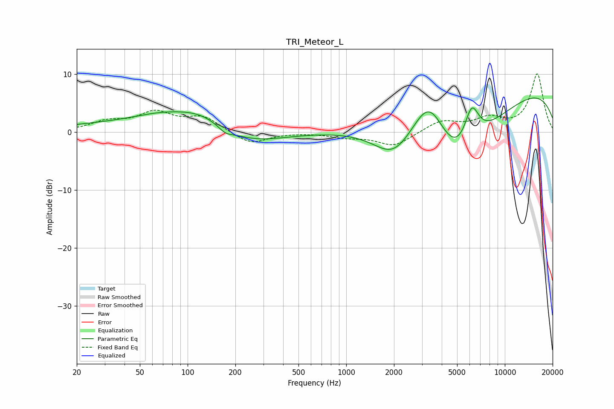

# TRI_Meteor_L
See [usage instructions](https://github.com/jaakkopasanen/AutoEq#usage) for more options and info.

### Parametric EQs
Apply preamp of -5.9 dB when using parametric equalizer.

|   # | Type    |   Fc (Hz) |    Q |   Gain (dB) |
|-----|---------|-----------|------|-------------|
|   1 | Peaking |        32 | 0.43 |         1.2 |
|   2 | Peaking |        64 | 0.86 |         1.1 |
|   3 | Peaking |       123 | 0.71 |         3.8 |
|   4 | Peaking |       173 | 3.09 |        -1   |
|   5 | Peaking |       226 | 0.66 |        -2.8 |
|   6 | Peaking |      2001 | 1.12 |        -5.4 |
|   7 | Peaking |      3337 | 1.19 |         9.6 |
|   8 | Peaking |      4937 | 0.56 |       -16.4 |
|   9 | Peaking |      6181 | 2.88 |         6.7 |
|  10 | Peaking |      8433 | 0.18 |        10.1 |

### Fixed Band EQs
When using fixed band (also called graphic) equalizer, apply preamp of **-10.1 dB** (if available) and set gains manually with these parameters.

|   # | Type    |   Fc (Hz) |    Q |   Gain (dB) |
|-----|---------|-----------|------|-------------|
|   1 | Peaking |        31 | 1.41 |         1.6 |
|   2 | Peaking |        62 | 1.41 |         3.1 |
|   3 | Peaking |       125 | 1.41 |         2.5 |
|   4 | Peaking |       250 | 1.41 |        -2.2 |
|   5 | Peaking |       500 | 1.41 |        -0   |
|   6 | Peaking |      1000 | 1.41 |        -0.8 |
|   7 | Peaking |      2000 | 1.41 |        -2.4 |
|   8 | Peaking |      4000 | 1.41 |         1.9 |
|   9 | Peaking |      8000 | 1.41 |         2.1 |
|  10 | Peaking |     16000 | 1.41 |        10   |

### Graphs

