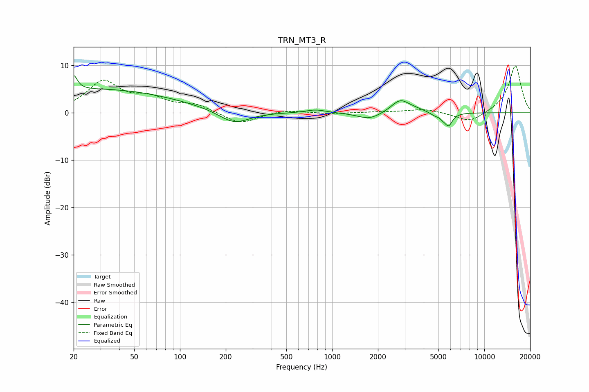

# TRN_MT3_R
See [usage instructions](https://github.com/jaakkopasanen/AutoEq#usage) for more options and info.

### Parametric EQs
Apply preamp of -8.0 dB when using parametric equalizer.

|   # | Type    |   Fc (Hz) |    Q |   Gain (dB) |
|-----|---------|-----------|------|-------------|
|   1 | Peaking |        20 | 5.92 |         3.1 |
|   2 | Peaking |        29 | 0.26 |         4.9 |
|   3 | Peaking |       227 | 1.41 |        -2.8 |
|   4 | Peaking |       780 | 2.21 |         0.7 |
|   5 | Peaking |      1756 | 1.85 |        -1.5 |
|   6 | Peaking |      2796 | 2.44 |         2.5 |
|   7 | Peaking |      3464 | 1.61 |         0.6 |
|   8 | Peaking |      5039 | 5.88 |         1.8 |
|   9 | Peaking |      5073 | 4.04 |        -2.8 |
|  10 | Peaking |      5835 | 5.74 |        -2.3 |

### Fixed Band EQs
When using fixed band (also called graphic) equalizer, apply preamp of **-10.0 dB** (if available) and set gains manually with these parameters.

|   # | Type    |   Fc (Hz) |    Q |   Gain (dB) |
|-----|---------|-----------|------|-------------|
|   1 | Peaking |        31 | 1.41 |         6.4 |
|   2 | Peaking |        62 | 1.41 |         2.6 |
|   3 | Peaking |       125 | 1.41 |         1.6 |
|   4 | Peaking |       250 | 1.41 |        -2.4 |
|   5 | Peaking |       500 | 1.41 |         0.7 |
|   6 | Peaking |      1000 | 1.41 |        -0.2 |
|   7 | Peaking |      2000 | 1.41 |         0.2 |
|   8 | Peaking |      4000 | 1.41 |         0.8 |
|   9 | Peaking |      8000 | 1.41 |        -2.2 |
|  10 | Peaking |     16000 | 1.41 |        10.1 |

### Graphs

