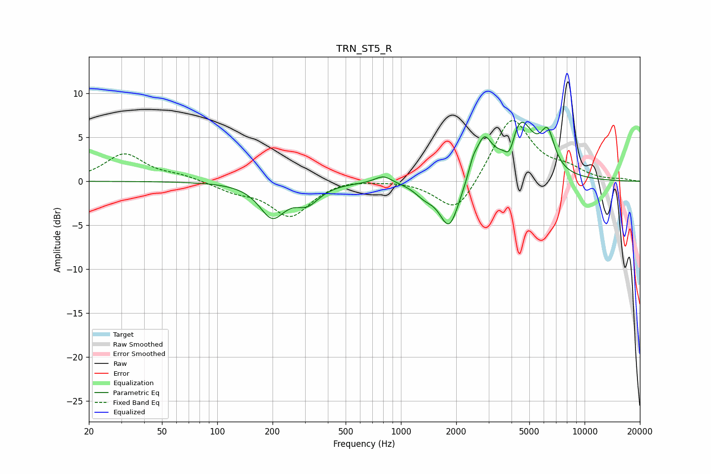

# TRN_ST5_R
See [usage instructions](https://github.com/jaakkopasanen/AutoEq#usage) for more options and info.

### Parametric EQs
Apply preamp of -6.8 dB when using parametric equalizer.

|   # | Type    |   Fc (Hz) |    Q |   Gain (dB) |
|-----|---------|-----------|------|-------------|
|   1 | Peaking |       199 | 2.04 |        -3.8 |
|   2 | Peaking |       309 | 2.15 |        -2   |
|   3 | Peaking |       802 | 3.07 |         0.9 |
|   4 | Peaking |      1346 | 2.65 |        -1.1 |
|   5 | Peaking |      1834 | 2.61 |        -5.5 |
|   6 | Peaking |      2468 | 5.85 |         1.3 |
|   7 | Peaking |      2831 | 3.33 |         4.1 |
|   8 | Peaking |      3918 | 4.79 |        -2.5 |
|   9 | Peaking |      4423 | 1.92 |         6.9 |
|  10 | Peaking |      6292 | 3.66 |         4   |

### Fixed Band EQs
When using fixed band (also called graphic) equalizer, apply preamp of **-7.0 dB** (if available) and set gains manually with these parameters.

|   # | Type    |   Fc (Hz) |    Q |   Gain (dB) |
|-----|---------|-----------|------|-------------|
|   1 | Peaking |        31 | 1.41 |         3.1 |
|   2 | Peaking |        62 | 1.41 |         0.6 |
|   3 | Peaking |       125 | 1.41 |        -1   |
|   4 | Peaking |       250 | 1.41 |        -3.9 |
|   5 | Peaking |       500 | 1.41 |         0.3 |
|   6 | Peaking |      1000 | 1.41 |         0.1 |
|   7 | Peaking |      2000 | 1.41 |        -4   |
|   8 | Peaking |      4000 | 1.41 |         7.4 |
|   9 | Peaking |      8000 | 1.41 |         1.1 |
|  10 | Peaking |     16000 | 1.41 |         0.2 |

### Graphs

