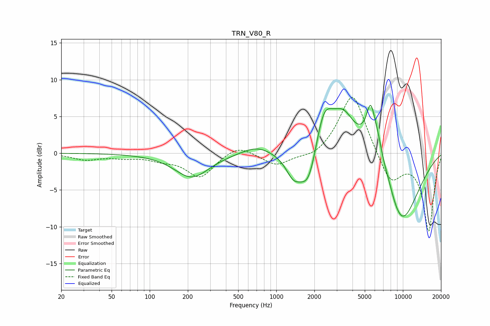

# TRN_V80_R
See [usage instructions](https://github.com/jaakkopasanen/AutoEq#usage) for more options and info.

### Parametric EQs
Apply preamp of -6.6 dB when using parametric equalizer.

|   # | Type    |   Fc (Hz) |    Q |   Gain (dB) |
|-----|---------|-----------|------|-------------|
|   1 | Peaking |       215 | 1.04 |        -3.3 |
|   2 | Peaking |       704 | 1.19 |         1.2 |
|   3 | Peaking |      1361 | 2.4  |        -2.5 |
|   4 | Peaking |      1810 | 1.85 |        -6.3 |
|   5 | Peaking |      2359 | 1.83 |         6.8 |
|   6 | Peaking |      3400 | 1.53 |         4.7 |
|   7 | Peaking |      5538 | 4.52 |         3.6 |
|   8 | Peaking |      6289 | 1.46 |         7.6 |
|   9 | Peaking |      6932 | 3.92 |        -1.2 |
|  10 | Peaking |      9517 | 0.81 |       -10.8 |

### Fixed Band EQs
When using fixed band (also called graphic) equalizer, apply preamp of **-7.7 dB** (if available) and set gains manually with these parameters.

|   # | Type    |   Fc (Hz) |    Q |   Gain (dB) |
|-----|---------|-----------|------|-------------|
|   1 | Peaking |        31 | 1.41 |        -0.8 |
|   2 | Peaking |        62 | 1.41 |        -0.5 |
|   3 | Peaking |       125 | 1.41 |        -0.7 |
|   4 | Peaking |       250 | 1.41 |        -3.2 |
|   5 | Peaking |       500 | 1.41 |         1.3 |
|   6 | Peaking |      1000 | 1.41 |        -1.7 |
|   7 | Peaking |      2000 | 1.41 |        -0.8 |
|   8 | Peaking |      4000 | 1.41 |         8.5 |
|   9 | Peaking |      8000 | 1.41 |        -4.2 |
|  10 | Peaking |     16000 | 1.41 |       -10.5 |

### Graphs

