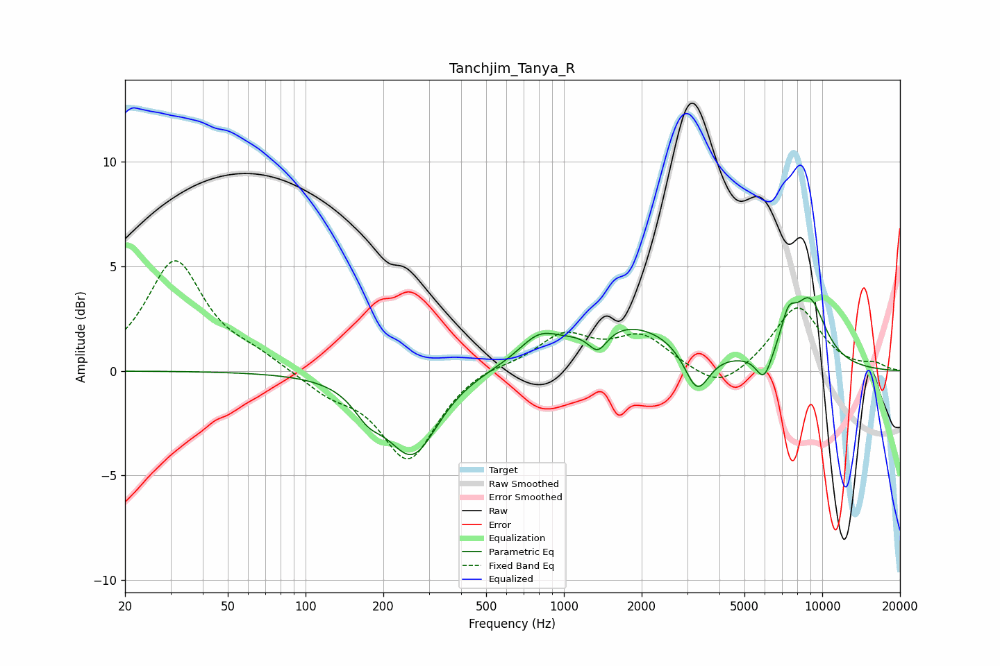

# Tanchjim_Tanya_R
See [usage instructions](https://github.com/jaakkopasanen/AutoEq#usage) for more options and info.

### Parametric EQs
Apply preamp of -3.6 dB when using parametric equalizer.

|   # | Type    |   Fc (Hz) |    Q |   Gain (dB) |
|-----|---------|-----------|------|-------------|
|   1 | Peaking |       175 | 2.43 |        -1.1 |
|   2 | Peaking |       259 | 1.44 |        -3.9 |
|   3 | Peaking |       661 | 1.3  |        -0   |
|   4 | Peaking |       796 | 1.89 |         1   |
|   5 | Peaking |      1354 | 3.83 |        -1.1 |
|   6 | Peaking |      1764 | 0.61 |         2.2 |
|   7 | Peaking |      3277 | 2.9  |        -2.1 |
|   8 | Peaking |      5952 | 4.39 |        -1.3 |
|   9 | Peaking |      7391 | 4.38 |         1.4 |
|  10 | Peaking |      8923 | 1.98 |         3.1 |

### Fixed Band EQs
When using fixed band (also called graphic) equalizer, apply preamp of **-5.4 dB** (if available) and set gains manually with these parameters.

|   # | Type    |   Fc (Hz) |    Q |   Gain (dB) |
|-----|---------|-----------|------|-------------|
|   1 | Peaking |        31 | 1.41 |         5.2 |
|   2 | Peaking |        62 | 1.41 |         0.6 |
|   3 | Peaking |       125 | 1.41 |        -0.9 |
|   4 | Peaking |       250 | 1.41 |        -4.2 |
|   5 | Peaking |       500 | 1.41 |         0.3 |
|   6 | Peaking |      1000 | 1.41 |         1.7 |
|   7 | Peaking |      2000 | 1.41 |         1.6 |
|   8 | Peaking |      4000 | 1.41 |        -1.1 |
|   9 | Peaking |      8000 | 1.41 |         3.1 |
|  10 | Peaking |     16000 | 1.41 |         0.3 |

### Graphs

