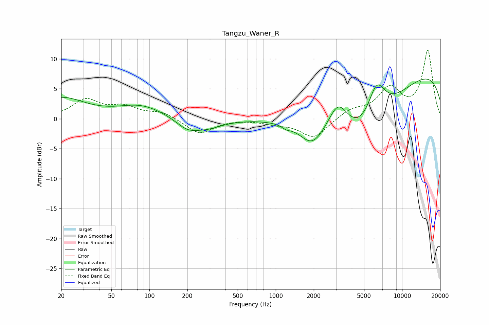

# Tangzu_Waner_R
See [usage instructions](https://github.com/jaakkopasanen/AutoEq#usage) for more options and info.

### Parametric EQs
Apply preamp of -6.7 dB when using parametric equalizer.

|   # | Type    |   Fc (Hz) |    Q |   Gain (dB) |
|-----|---------|-----------|------|-------------|
|   1 | Peaking |        20 | 0.76 |         3.4 |
|   2 | Peaking |        86 | 0.77 |         2.1 |
|   3 | Peaking |       199 | 1.57 |        -1.7 |
|   4 | Peaking |       287 | 1.16 |        -1.4 |
|   5 | Peaking |      1214 | 4.16 |        -0.5 |
|   6 | Peaking |      1947 | 1.42 |        -4.1 |
|   7 | Peaking |      3126 | 1.78 |         5.1 |
|   8 | Peaking |      4839 | 0.49 |       -11   |
|   9 | Peaking |      6281 | 1.9  |         6.4 |
|  10 | Peaking |      9937 | 0.18 |         9.2 |

### Fixed Band EQs
When using fixed band (also called graphic) equalizer, apply preamp of **-11.5 dB** (if available) and set gains manually with these parameters.

|   # | Type    |   Fc (Hz) |    Q |   Gain (dB) |
|-----|---------|-----------|------|-------------|
|   1 | Peaking |        31 | 1.41 |         3   |
|   2 | Peaking |        62 | 1.41 |         1.8 |
|   3 | Peaking |       125 | 1.41 |         1.1 |
|   4 | Peaking |       250 | 1.41 |        -2.5 |
|   5 | Peaking |       500 | 1.41 |        -0   |
|   6 | Peaking |      1000 | 1.41 |        -0.6 |
|   7 | Peaking |      2000 | 1.41 |        -3.2 |
|   8 | Peaking |      4000 | 1.41 |         1.4 |
|   9 | Peaking |      8000 | 1.41 |         4.8 |
|  10 | Peaking |     16000 | 1.41 |        11.2 |

### Graphs

