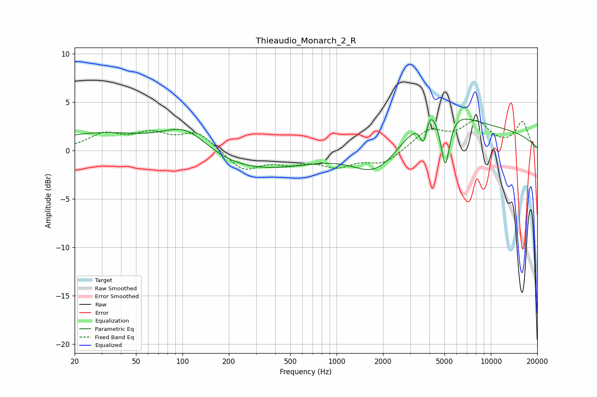

# Thieaudio_Monarch_2_R
See [usage instructions](https://github.com/jaakkopasanen/AutoEq#usage) for more options and info.

### Parametric EQs
Apply preamp of -3.3 dB when using parametric equalizer.

|   # | Type    |   Fc (Hz) |    Q |   Gain (dB) |
|-----|---------|-----------|------|-------------|
|   1 | Peaking |        83 | 0.2  |         3.2 |
|   2 | Peaking |       105 | 0.91 |         3.1 |
|   3 | Peaking |       187 | 0.31 |        -4.8 |
|   4 | Peaking |      1821 | 0.89 |        -3.7 |
|   5 | Peaking |      3678 | 5.92 |        -2.9 |
|   6 | Peaking |      3943 | 4.36 |         1.3 |
|   7 | Peaking |      4521 | 0.87 |         3.2 |
|   8 | Peaking |      5051 | 5.99 |         1   |
|   9 | Peaking |      5056 | 4.76 |        -7   |
|  10 | Peaking |      6462 | 0.18 |         2.2 |

### Fixed Band EQs
When using fixed band (also called graphic) equalizer, apply preamp of **-3.2 dB** (if available) and set gains manually with these parameters.

|   # | Type    |   Fc (Hz) |    Q |   Gain (dB) |
|-----|---------|-----------|------|-------------|
|   1 | Peaking |        31 | 1.41 |         1.6 |
|   2 | Peaking |        62 | 1.41 |         1.5 |
|   3 | Peaking |       125 | 1.41 |         1.8 |
|   4 | Peaking |       250 | 1.41 |        -2.1 |
|   5 | Peaking |       500 | 1.41 |        -1   |
|   6 | Peaking |      1000 | 1.41 |        -1.4 |
|   7 | Peaking |      2000 | 1.41 |        -1.3 |
|   8 | Peaking |      4000 | 1.41 |         2   |
|   9 | Peaking |      8000 | 1.41 |         2.7 |
|  10 | Peaking |     16000 | 1.41 |         2.9 |

### Graphs

