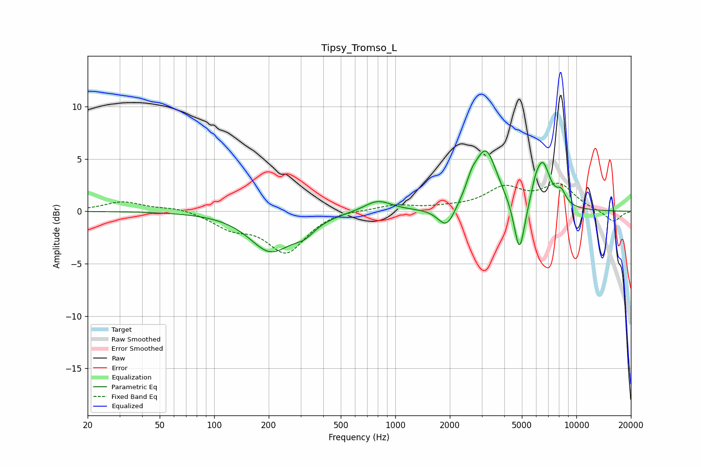

# Tipsy_Tromso_L
See [usage instructions](https://github.com/jaakkopasanen/AutoEq#usage) for more options and info.

### Parametric EQs
Apply preamp of -5.9 dB when using parametric equalizer.

|   # | Type    |   Fc (Hz) |    Q |   Gain (dB) |
|-----|---------|-----------|------|-------------|
|   1 | Peaking |       205 | 1.22 |        -3.7 |
|   2 | Peaking |       315 | 2.32 |        -1.1 |
|   3 | Peaking |       800 | 1.87 |         1.1 |
|   4 | Peaking |      1922 | 2.95 |        -2.2 |
|   5 | Peaking |      2637 | 4.92 |         1   |
|   6 | Peaking |      3153 | 2.18 |         5.8 |
|   7 | Peaking |      4852 | 4.67 |        -5.3 |
|   8 | Peaking |      5925 | 6    |         0.9 |
|   9 | Peaking |      6505 | 3.23 |         4.3 |
|  10 | Peaking |      8255 | 5.05 |         1.2 |

### Fixed Band EQs
When using fixed band (also called graphic) equalizer, apply preamp of **-2.8 dB** (if available) and set gains manually with these parameters.

|   # | Type    |   Fc (Hz) |    Q |   Gain (dB) |
|-----|---------|-----------|------|-------------|
|   1 | Peaking |        31 | 1.41 |         0.9 |
|   2 | Peaking |        62 | 1.41 |         0.4 |
|   3 | Peaking |       125 | 1.41 |        -1.4 |
|   4 | Peaking |       250 | 1.41 |        -3.8 |
|   5 | Peaking |       500 | 1.41 |         0.2 |
|   6 | Peaking |      1000 | 1.41 |         0.6 |
|   7 | Peaking |      2000 | 1.41 |         0.2 |
|   8 | Peaking |      4000 | 1.41 |         2.1 |
|   9 | Peaking |      8000 | 1.41 |         2.4 |
|  10 | Peaking |     16000 | 1.41 |        -1.1 |

### Graphs

