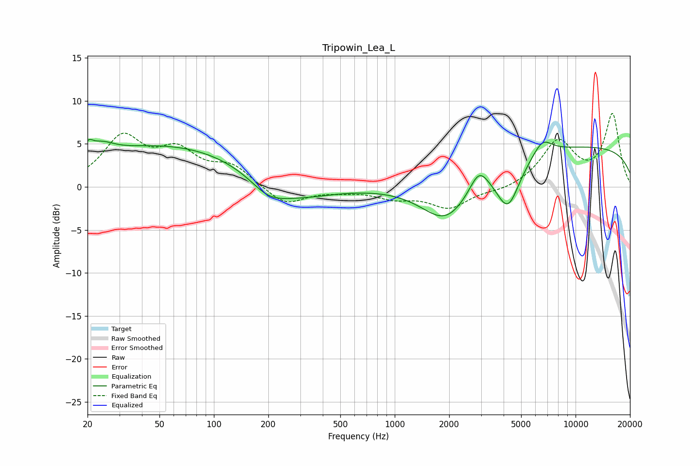

# Tripowin_Lea_L
See [usage instructions](https://github.com/jaakkopasanen/AutoEq#usage) for more options and info.

### Parametric EQs
Apply preamp of -5.6 dB when using parametric equalizer.

|   # | Type    |   Fc (Hz) |    Q |   Gain (dB) |
|-----|---------|-----------|------|-------------|
|   1 | Peaking |        20 | 5.77 |         1.2 |
|   2 | Peaking |        24 | 1.99 |         1.5 |
|   3 | Peaking |        57 | 0.29 |         4.9 |
|   4 | Peaking |       199 | 1.46 |        -1.7 |
|   5 | Peaking |       270 | 0.68 |        -2.2 |
|   6 | Peaking |      1934 | 1    |        -5.4 |
|   7 | Peaking |      2924 | 2.83 |         2.5 |
|   8 | Peaking |      4230 | 2.19 |        -5.2 |
|   9 | Peaking |      6564 | 2.58 |         1.8 |
|  10 | Peaking |     10000 | 0.18 |         4.8 |

### Fixed Band EQs
When using fixed band (also called graphic) equalizer, apply preamp of **-8.6 dB** (if available) and set gains manually with these parameters.

|   # | Type    |   Fc (Hz) |    Q |   Gain (dB) |
|-----|---------|-----------|------|-------------|
|   1 | Peaking |        31 | 1.41 |         5.5 |
|   2 | Peaking |        62 | 1.41 |         3.6 |
|   3 | Peaking |       125 | 1.41 |         2.2 |
|   4 | Peaking |       250 | 1.41 |        -2.2 |
|   5 | Peaking |       500 | 1.41 |        -0.3 |
|   6 | Peaking |      1000 | 1.41 |        -1.1 |
|   7 | Peaking |      2000 | 1.41 |        -2.4 |
|   8 | Peaking |      4000 | 1.41 |        -0.5 |
|   9 | Peaking |      8000 | 1.41 |         5.2 |
|  10 | Peaking |     16000 | 1.41 |         8.3 |

### Graphs

