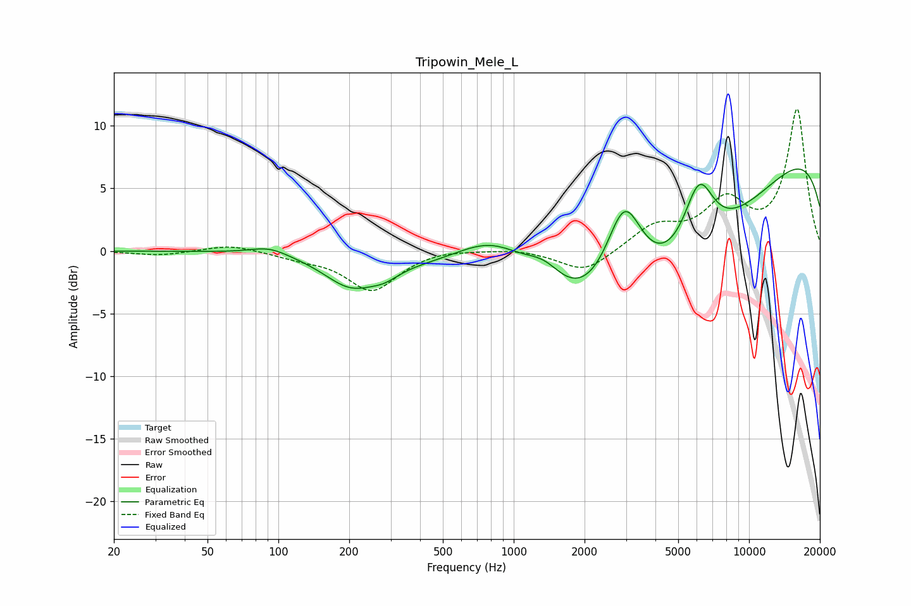

# Tripowin_Mele_L
See [usage instructions](https://github.com/jaakkopasanen/AutoEq#usage) for more options and info.

### Parametric EQs
Apply preamp of -6.6 dB when using parametric equalizer.

|   # | Type    |   Fc (Hz) |    Q |   Gain (dB) |
|-----|---------|-----------|------|-------------|
|   1 | Peaking |        92 | 1.76 |         0.7 |
|   2 | Peaking |       203 | 1.25 |        -2.4 |
|   3 | Peaking |       283 | 2.26 |        -0.7 |
|   4 | Peaking |       834 | 0.74 |         5.6 |
|   5 | Peaking |      1350 | 1.65 |         2.1 |
|   6 | Peaking |      2952 | 1.67 |         8.1 |
|   7 | Peaking |      3132 | 0.24 |       -13.2 |
|   8 | Peaking |      6124 | 2.11 |         5.5 |
|   9 | Peaking |      6665 | 0.2  |        -0.5 |
|  10 | Peaking |     10000 | 0.18 |        10.9 |

### Fixed Band EQs
When using fixed band (also called graphic) equalizer, apply preamp of **-11.4 dB** (if available) and set gains manually with these parameters.

|   # | Type    |   Fc (Hz) |    Q |   Gain (dB) |
|-----|---------|-----------|------|-------------|
|   1 | Peaking |        31 | 1.41 |        -0.4 |
|   2 | Peaking |        62 | 1.41 |         0.6 |
|   3 | Peaking |       125 | 1.41 |        -0.4 |
|   4 | Peaking |       250 | 1.41 |        -3.1 |
|   5 | Peaking |       500 | 1.41 |         0.2 |
|   6 | Peaking |      1000 | 1.41 |         0.2 |
|   7 | Peaking |      2000 | 1.41 |        -1.8 |
|   8 | Peaking |      4000 | 1.41 |         1.9 |
|   9 | Peaking |      8000 | 1.41 |         3.6 |
|  10 | Peaking |     16000 | 1.41 |        11.2 |

### Graphs

