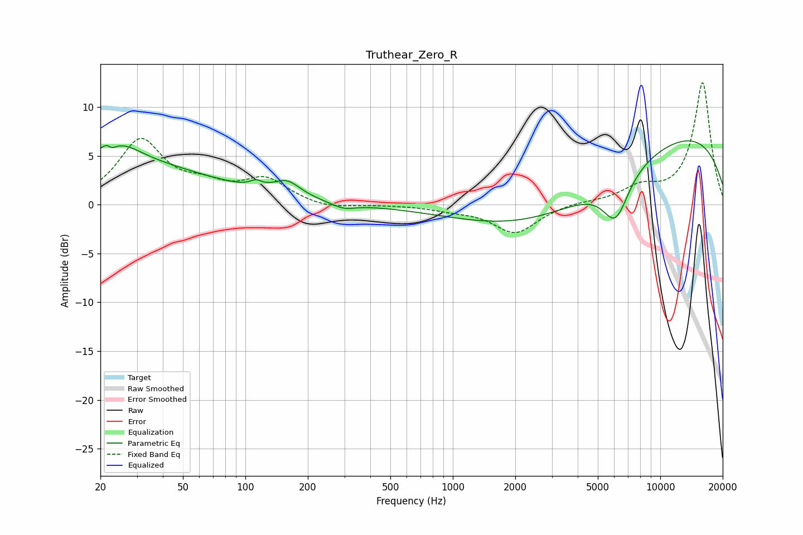

# Truthear_Zero_R
See [usage instructions](https://github.com/jaakkopasanen/AutoEq#usage) for more options and info.

### Parametric EQs
Apply preamp of -6.6 dB when using parametric equalizer.

|   # | Type    |   Fc (Hz) |    Q |   Gain (dB) |
|-----|---------|-----------|------|-------------|
|   1 | Peaking |        20 | 0.26 |         4.4 |
|   2 | Peaking |        22 | 5.79 |         3.2 |
|   3 | Peaking |        22 | 5.95 |        -3.1 |
|   4 | Peaking |        25 | 1.47 |         1.7 |
|   5 | Peaking |       112 | 4.99 |         0.6 |
|   6 | Peaking |       159 | 2.14 |         1.6 |
|   7 | Peaking |       296 | 2.47 |        -0.6 |
|   8 | Peaking |      3450 | 0.34 |        -5.3 |
|   9 | Peaking |      6095 | 2.19 |        -4.5 |
|  10 | Peaking |     10000 | 0.23 |         8.4 |

### Fixed Band EQs
When using fixed band (also called graphic) equalizer, apply preamp of **-12.6 dB** (if available) and set gains manually with these parameters.

|   # | Type    |   Fc (Hz) |    Q |   Gain (dB) |
|-----|---------|-----------|------|-------------|
|   1 | Peaking |        31 | 1.41 |         6.4 |
|   2 | Peaking |        62 | 1.41 |         1.4 |
|   3 | Peaking |       125 | 1.41 |         2.4 |
|   4 | Peaking |       250 | 1.41 |        -0.5 |
|   5 | Peaking |       500 | 1.41 |        -0   |
|   6 | Peaking |      1000 | 1.41 |        -0.4 |
|   7 | Peaking |      2000 | 1.41 |        -2.9 |
|   8 | Peaking |      4000 | 1.41 |         0.2 |
|   9 | Peaking |      8000 | 1.41 |         1.5 |
|  10 | Peaking |     16000 | 1.41 |        12.5 |

### Graphs

