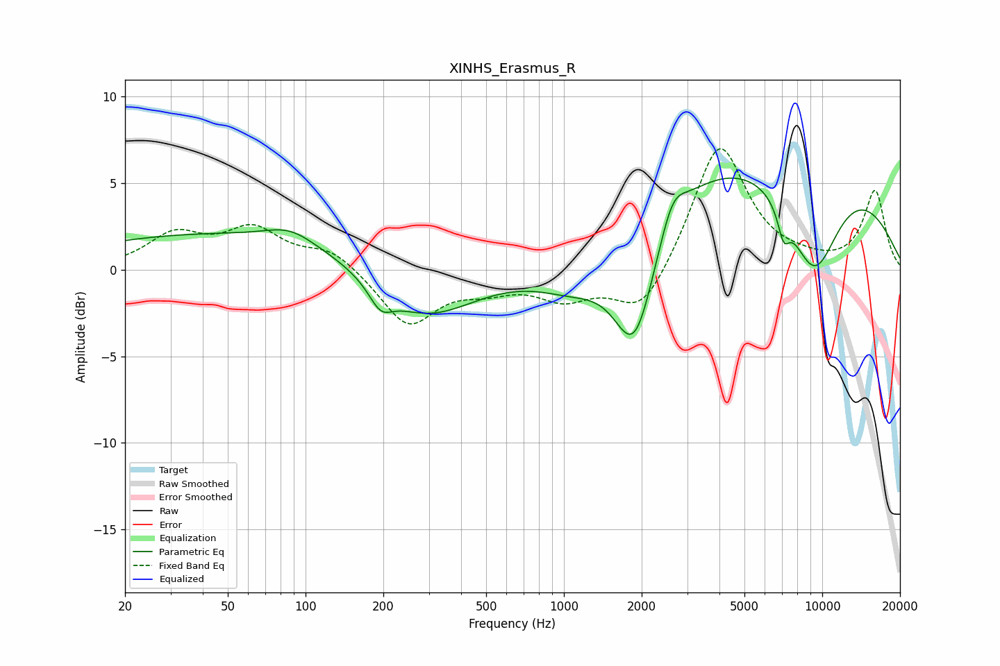

# XINHS_Erasmus_R
See [usage instructions](https://github.com/jaakkopasanen/AutoEq#usage) for more options and info.

### Parametric EQs
Apply preamp of -5.4 dB when using parametric equalizer.

|   # | Type    |   Fc (Hz) |    Q |   Gain (dB) |
|-----|---------|-----------|------|-------------|
|   1 | Peaking |        65 | 0.18 |         2.2 |
|   2 | Peaking |        87 | 1.5  |         0.8 |
|   3 | Peaking |       195 | 3.15 |        -1.3 |
|   4 | Peaking |       284 | 0.67 |        -3.8 |
|   5 | Peaking |      1122 | 0.89 |        -2.4 |
|   6 | Peaking |      1879 | 1.68 |        -7.1 |
|   7 | Peaking |      2631 | 2.94 |         1.8 |
|   8 | Peaking |      6284 | 0.22 |         7.3 |
|   9 | Peaking |      7087 | 5.92 |        -1.6 |
|  10 | Peaking |      9267 | 1.19 |        -6.5 |

### Fixed Band EQs
When using fixed band (also called graphic) equalizer, apply preamp of **-7.1 dB** (if available) and set gains manually with these parameters.

|   # | Type    |   Fc (Hz) |    Q |   Gain (dB) |
|-----|---------|-----------|------|-------------|
|   1 | Peaking |        31 | 1.41 |         1.9 |
|   2 | Peaking |        62 | 1.41 |         2.2 |
|   3 | Peaking |       125 | 1.41 |         1.2 |
|   4 | Peaking |       250 | 1.41 |        -3.2 |
|   5 | Peaking |       500 | 1.41 |        -0.8 |
|   6 | Peaking |      1000 | 1.41 |        -1.5 |
|   7 | Peaking |      2000 | 1.41 |        -2.8 |
|   8 | Peaking |      4000 | 1.41 |         7.4 |
|   9 | Peaking |      8000 | 1.41 |         0.3 |
|  10 | Peaking |     16000 | 1.41 |         4.5 |

### Graphs

