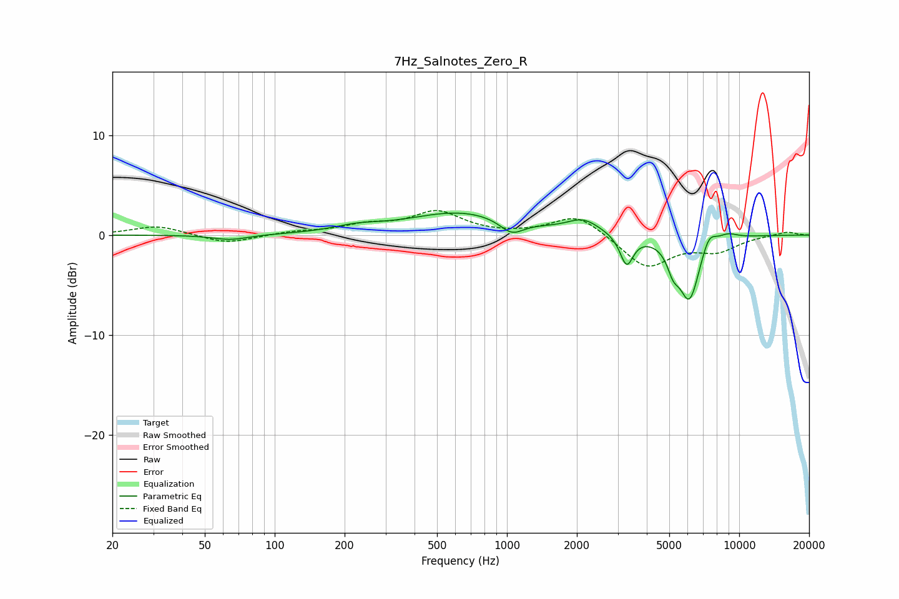

# 7Hz_Salnotes_Zero_R
See [usage instructions](https://github.com/jaakkopasanen/AutoEq#usage) for more options and info.

### Parametric EQs
Apply preamp of -2.3 dB when using parametric equalizer.

|   # | Type    |   Fc (Hz) |    Q |   Gain (dB) |
|-----|---------|-----------|------|-------------|
|   1 | Peaking |        64 | 1.86 |        -0.5 |
|   2 | Peaking |       226 | 1.38 |         0.6 |
|   3 | Peaking |       637 | 0.62 |         2.3 |
|   4 | Peaking |      1048 | 2.76 |        -1.4 |
|   5 | Peaking |      2134 | 2.03 |         1.3 |
|   6 | Peaking |      3275 | 5.01 |        -3   |
|   7 | Peaking |      5194 | 5.52 |        -1.8 |
|   8 | Peaking |      6104 | 2.97 |        -6.5 |
|   9 | Peaking |      7393 | 4.16 |         1.7 |
|  10 | Peaking |      8938 | 3.11 |         0.6 |

### Fixed Band EQs
When using fixed band (also called graphic) equalizer, apply preamp of **-2.6 dB** (if available) and set gains manually with these parameters.

|   # | Type    |   Fc (Hz) |    Q |   Gain (dB) |
|-----|---------|-----------|------|-------------|
|   1 | Peaking |        31 | 1.41 |         0.9 |
|   2 | Peaking |        62 | 1.41 |        -0.9 |
|   3 | Peaking |       125 | 1.41 |         0.3 |
|   4 | Peaking |       250 | 1.41 |         0.9 |
|   5 | Peaking |       500 | 1.41 |         2.2 |
|   6 | Peaking |      1000 | 1.41 |        -0   |
|   7 | Peaking |      2000 | 1.41 |         2.1 |
|   8 | Peaking |      4000 | 1.41 |        -3.3 |
|   9 | Peaking |      8000 | 1.41 |        -1.4 |
|  10 | Peaking |     16000 | 1.41 |         0.4 |

### Graphs

