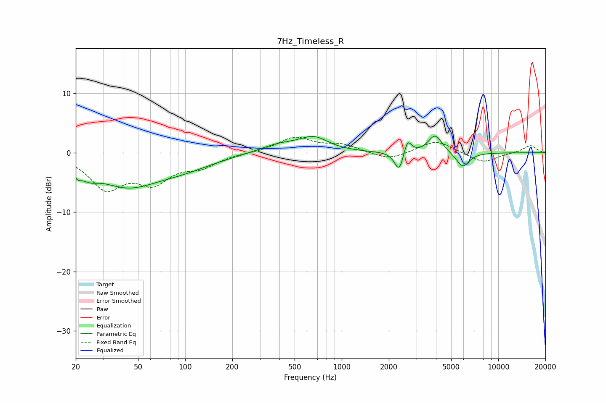

# 7Hz_Timeless_R
See [usage instructions](https://github.com/jaakkopasanen/AutoEq#usage) for more options and info.

### Parametric EQs
Apply preamp of -2.9 dB when using parametric equalizer.

|   # | Type    |   Fc (Hz) |    Q |   Gain (dB) |
|-----|---------|-----------|------|-------------|
|   1 | Peaking |        21 | 5.61 |        -1.2 |
|   2 | Peaking |        24 | 2.55 |        -1.5 |
|   3 | Peaking |        42 | 0.7  |        -5   |
|   4 | Peaking |        97 | 0.69 |        -1.9 |
|   5 | Peaking |       395 | 1.1  |         1.4 |
|   6 | Peaking |       665 | 1.52 |         2.3 |
|   7 | Peaking |      2330 | 4.88 |        -3.5 |
|   8 | Peaking |      2629 | 5.96 |         2.6 |
|   9 | Peaking |      3951 | 3.21 |         3   |
|  10 | Peaking |      5930 | 3.3  |        -2.5 |

### Fixed Band EQs
When using fixed band (also called graphic) equalizer, apply preamp of **-2.7 dB** (if available) and set gains manually with these parameters.

|   # | Type    |   Fc (Hz) |    Q |   Gain (dB) |
|-----|---------|-----------|------|-------------|
|   1 | Peaking |        31 | 1.41 |        -5.6 |
|   2 | Peaking |        62 | 1.41 |        -4.4 |
|   3 | Peaking |       125 | 1.41 |        -2   |
|   4 | Peaking |       250 | 1.41 |         0   |
|   5 | Peaking |       500 | 1.41 |         2.5 |
|   6 | Peaking |      1000 | 1.41 |         1.3 |
|   7 | Peaking |      2000 | 1.41 |        -1.3 |
|   8 | Peaking |      4000 | 1.41 |         2.1 |
|   9 | Peaking |      8000 | 1.41 |        -1.7 |
|  10 | Peaking |     16000 | 1.41 |         1.3 |

### Graphs

