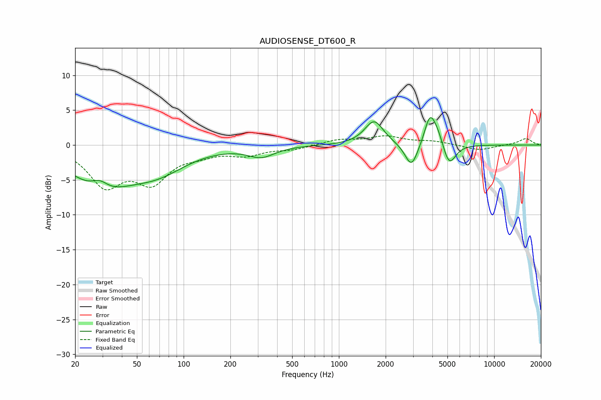

# AUDIOSENSE_DT600_R
See [usage instructions](https://github.com/jaakkopasanen/AutoEq#usage) for more options and info.

### Parametric EQs
Apply preamp of -4.0 dB when using parametric equalizer.

|   # | Type    |   Fc (Hz) |    Q |   Gain (dB) |
|-----|---------|-----------|------|-------------|
|   1 | Peaking |        29 | 2.67 |         1.5 |
|   2 | Peaking |        29 | 0.72 |        -5.7 |
|   3 | Peaking |        68 | 0.78 |        -3   |
|   4 | Peaking |       316 | 1.66 |        -1.5 |
|   5 | Peaking |      1685 | 2.34 |         3.5 |
|   6 | Peaking |      2933 | 3.43 |        -3.5 |
|   7 | Peaking |      3845 | 4.17 |         3.7 |
|   8 | Peaking |      4276 | 3.27 |         2.1 |
|   9 | Peaking |      5075 | 3.7  |        -2.5 |
|  10 | Peaking |      5333 | 3.24 |        -0.9 |

### Fixed Band EQs
When using fixed band (also called graphic) equalizer, apply preamp of **-1.4 dB** (if available) and set gains manually with these parameters.

|   # | Type    |   Fc (Hz) |    Q |   Gain (dB) |
|-----|---------|-----------|------|-------------|
|   1 | Peaking |        31 | 1.41 |        -5.5 |
|   2 | Peaking |        62 | 1.41 |        -4.8 |
|   3 | Peaking |       125 | 1.41 |        -1   |
|   4 | Peaking |       250 | 1.41 |        -1.3 |
|   5 | Peaking |       500 | 1.41 |        -0.6 |
|   6 | Peaking |      1000 | 1.41 |         0.7 |
|   7 | Peaking |      2000 | 1.41 |         1.2 |
|   8 | Peaking |      4000 | 1.41 |         0.5 |
|   9 | Peaking |      8000 | 1.41 |        -0.8 |
|  10 | Peaking |     16000 | 1.41 |         0.9 |

### Graphs

