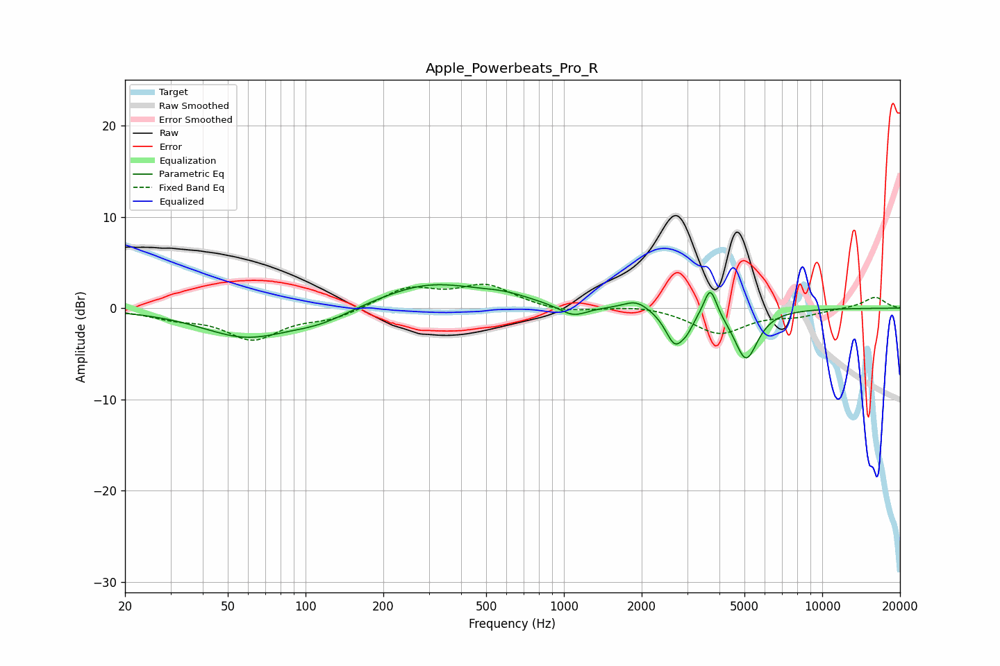

# Apple_Powerbeats_Pro_R
See [usage instructions](https://github.com/jaakkopasanen/AutoEq#usage) for more options and info.

### Parametric EQs
Apply preamp of -2.7 dB when using parametric equalizer.

|   # | Type    |   Fc (Hz) |    Q |   Gain (dB) |
|-----|---------|-----------|------|-------------|
|   1 | Peaking |        59 | 0.81 |        -3.1 |
|   2 | Peaking |       115 | 1.18 |        -1.2 |
|   3 | Peaking |       301 | 0.72 |         2.7 |
|   4 | Peaking |       591 | 1.39 |         0.7 |
|   5 | Peaking |      1087 | 2.58 |        -1.2 |
|   6 | Peaking |      1905 | 2.91 |         1   |
|   7 | Peaking |      2690 | 3.81 |        -3.7 |
|   8 | Peaking |      3004 | 5.52 |        -1   |
|   9 | Peaking |      3687 | 5.72 |         3.3 |
|  10 | Peaking |      5071 | 3.09 |        -5.5 |

### Fixed Band EQs
When using fixed band (also called graphic) equalizer, apply preamp of **-2.7 dB** (if available) and set gains manually with these parameters.

|   # | Type    |   Fc (Hz) |    Q |   Gain (dB) |
|-----|---------|-----------|------|-------------|
|   1 | Peaking |        31 | 1.41 |        -0.9 |
|   2 | Peaking |        62 | 1.41 |        -3.3 |
|   3 | Peaking |       125 | 1.41 |        -1.1 |
|   4 | Peaking |       250 | 1.41 |         2.2 |
|   5 | Peaking |       500 | 1.41 |         2.4 |
|   6 | Peaking |      1000 | 1.41 |        -0.6 |
|   7 | Peaking |      2000 | 1.41 |         0.4 |
|   8 | Peaking |      4000 | 1.41 |        -2.7 |
|   9 | Peaking |      8000 | 1.41 |        -0.7 |
|  10 | Peaking |     16000 | 1.41 |         1.2 |

### Graphs

