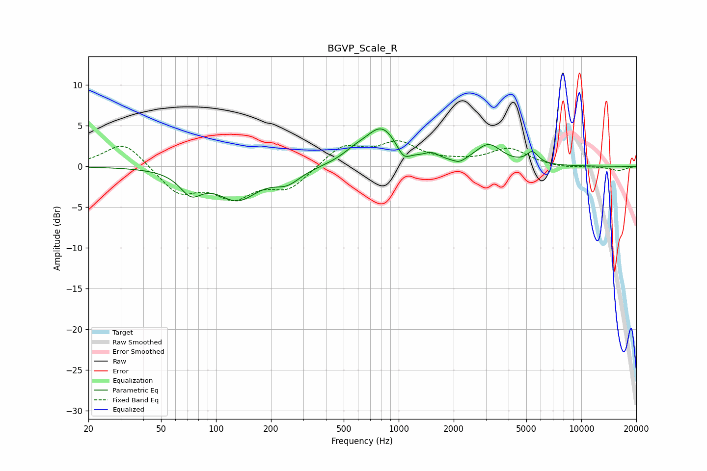

# BGVP_Scale_R
See [usage instructions](https://github.com/jaakkopasanen/AutoEq#usage) for more options and info.

### Parametric EQs
Apply preamp of -4.7 dB when using parametric equalizer.

|   # | Type    |   Fc (Hz) |    Q |   Gain (dB) |
|-----|---------|-----------|------|-------------|
|   1 | Peaking |        73 | 2.37 |        -2.6 |
|   2 | Peaking |       131 | 1.25 |        -3.8 |
|   3 | Peaking |       246 | 1.95 |        -1.6 |
|   4 | Peaking |       571 | 2.07 |         0.8 |
|   5 | Peaking |       810 | 1.53 |         4.7 |
|   6 | Peaking |      1061 | 3.88 |        -1.6 |
|   7 | Peaking |      1521 | 3.55 |         0.8 |
|   8 | Peaking |      2150 | 4.13 |        -0.6 |
|   9 | Peaking |      3106 | 1.97 |         2.5 |
|  10 | Peaking |      5396 | 4.4  |         1.4 |

### Fixed Band EQs
When using fixed band (also called graphic) equalizer, apply preamp of **-3.2 dB** (if available) and set gains manually with these parameters.

|   # | Type    |   Fc (Hz) |    Q |   Gain (dB) |
|-----|---------|-----------|------|-------------|
|   1 | Peaking |        31 | 1.41 |         3.2 |
|   2 | Peaking |        62 | 1.41 |        -3.2 |
|   3 | Peaking |       125 | 1.41 |        -3.4 |
|   4 | Peaking |       250 | 1.41 |        -2.6 |
|   5 | Peaking |       500 | 1.41 |         2.6 |
|   6 | Peaking |      1000 | 1.41 |         2.7 |
|   7 | Peaking |      2000 | 1.41 |         0.3 |
|   8 | Peaking |      4000 | 1.41 |         2.1 |
|   9 | Peaking |      8000 | 1.41 |        -0.3 |
|  10 | Peaking |     16000 | 1.41 |        -0.5 |

### Graphs

