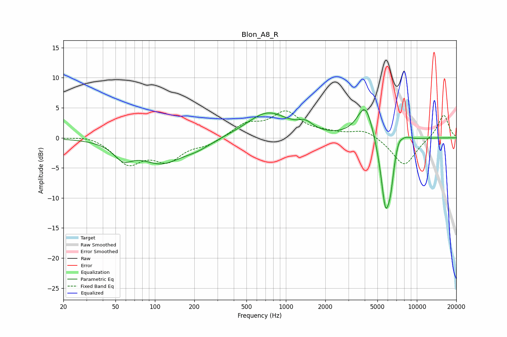

# Blon_A8_R
See [usage instructions](https://github.com/jaakkopasanen/AutoEq#usage) for more options and info.

### Parametric EQs
Apply preamp of -4.8 dB when using parametric equalizer.

|   # | Type    |   Fc (Hz) |    Q |   Gain (dB) |
|-----|---------|-----------|------|-------------|
|   1 | Peaking |        57 | 1.97 |        -2.5 |
|   2 | Peaking |       112 | 0.89 |        -3.9 |
|   3 | Peaking |       211 | 1.26 |        -1.1 |
|   4 | Peaking |       726 | 0.9  |         4.2 |
|   5 | Peaking |      1411 | 2.55 |         1.3 |
|   6 | Peaking |      4055 | 2.22 |         6.1 |
|   7 | Peaking |      5764 | 3.51 |       -12.2 |
|   8 | Peaking |      6302 | 6    |        -3.4 |
|   9 | Peaking |      7260 | 4.75 |         1.5 |
|  10 | Peaking |      8230 | 3.11 |         0.8 |

### Fixed Band EQs
When using fixed band (also called graphic) equalizer, apply preamp of **-4.6 dB** (if available) and set gains manually with these parameters.

|   # | Type    |   Fc (Hz) |    Q |   Gain (dB) |
|-----|---------|-----------|------|-------------|
|   1 | Peaking |        31 | 1.41 |         0.6 |
|   2 | Peaking |        62 | 1.41 |        -4.1 |
|   3 | Peaking |       125 | 1.41 |        -3.4 |
|   4 | Peaking |       250 | 1.41 |        -1.1 |
|   5 | Peaking |       500 | 1.41 |         2.2 |
|   6 | Peaking |      1000 | 1.41 |         4   |
|   7 | Peaking |      2000 | 1.41 |         0.6 |
|   8 | Peaking |      4000 | 1.41 |         1.4 |
|   9 | Peaking |      8000 | 1.41 |        -4.8 |
|  10 | Peaking |     16000 | 1.41 |         4   |

### Graphs

