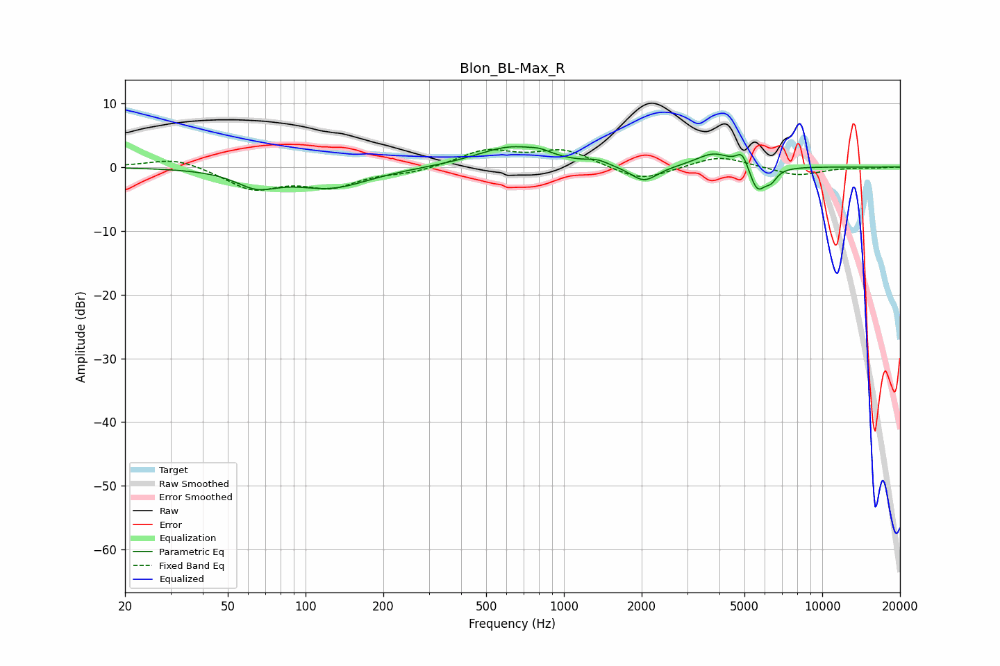

# Blon_BL-Max_R
See [usage instructions](https://github.com/jaakkopasanen/AutoEq#usage) for more options and info.

### Parametric EQs
Apply preamp of -3.3 dB when using parametric equalizer.

|   # | Type    |   Fc (Hz) |    Q |   Gain (dB) |
|-----|---------|-----------|------|-------------|
|   1 | Peaking |        65 | 1.76 |        -2.5 |
|   2 | Peaking |       126 | 0.96 |        -3.1 |
|   3 | Peaking |       629 | 1.05 |         3.2 |
|   4 | Peaking |       812 | 3.86 |         0.5 |
|   5 | Peaking |      1345 | 3.56 |         0.7 |
|   6 | Peaking |      2043 | 2.66 |        -2.6 |
|   7 | Peaking |      3806 | 2.06 |         2.2 |
|   8 | Peaking |      4908 | 5.96 |         2.5 |
|   9 | Peaking |      5608 | 4.3  |        -4.1 |
|  10 | Peaking |      6345 | 6    |        -1.5 |

### Fixed Band EQs
When using fixed band (also called graphic) equalizer, apply preamp of **-2.8 dB** (if available) and set gains manually with these parameters.

|   # | Type    |   Fc (Hz) |    Q |   Gain (dB) |
|-----|---------|-----------|------|-------------|
|   1 | Peaking |        31 | 1.41 |         1.6 |
|   2 | Peaking |        62 | 1.41 |        -3.4 |
|   3 | Peaking |       125 | 1.41 |        -2.8 |
|   4 | Peaking |       250 | 1.41 |        -0.8 |
|   5 | Peaking |       500 | 1.41 |         2.6 |
|   6 | Peaking |      1000 | 1.41 |         2.6 |
|   7 | Peaking |      2000 | 1.41 |        -2.3 |
|   8 | Peaking |      4000 | 1.41 |         1.8 |
|   9 | Peaking |      8000 | 1.41 |        -1.4 |
|  10 | Peaking |     16000 | 1.41 |        -0.1 |

### Graphs

