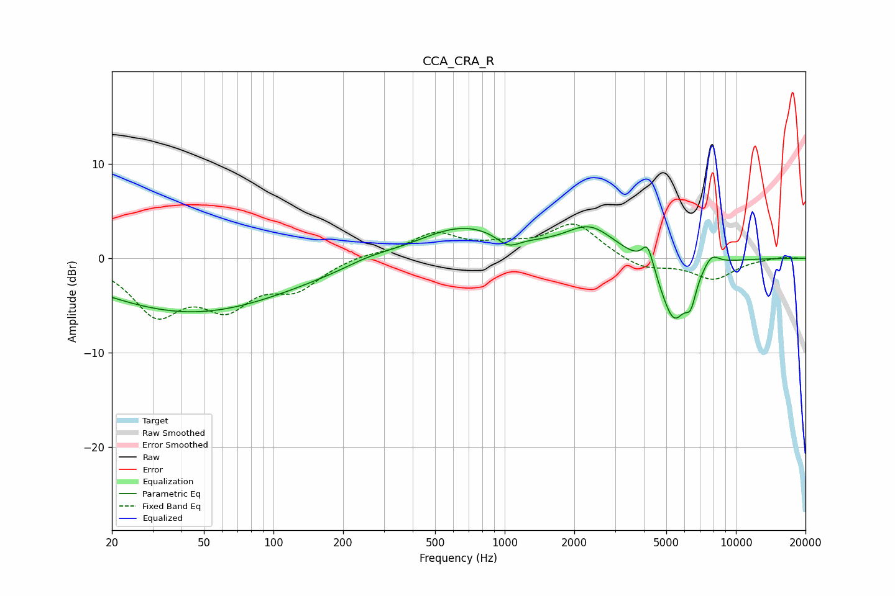

# CCA_CRA_R
See [usage instructions](https://github.com/jaakkopasanen/AutoEq#usage) for more options and info.

### Parametric EQs
Apply preamp of -3.4 dB when using parametric equalizer.

|   # | Type    |   Fc (Hz) |    Q |   Gain (dB) |
|-----|---------|-----------|------|-------------|
|   1 | Peaking |        37 | 0.36 |        -4.3 |
|   2 | Peaking |        78 | 0.34 |        -1.7 |
|   3 | Peaking |       258 | 1.35 |         0.6 |
|   4 | Peaking |       661 | 0.7  |         3.4 |
|   5 | Peaking |      1037 | 2.82 |        -1.3 |
|   6 | Peaking |      2343 | 1.31 |         3.1 |
|   7 | Peaking |      4156 | 5.66 |         2.6 |
|   8 | Peaking |      5390 | 2.31 |        -6.7 |
|   9 | Peaking |      6380 | 6    |        -2.4 |
|  10 | Peaking |      7835 | 3.84 |         1.4 |

### Fixed Band EQs
When using fixed band (also called graphic) equalizer, apply preamp of **-3.7 dB** (if available) and set gains manually with these parameters.

|   # | Type    |   Fc (Hz) |    Q |   Gain (dB) |
|-----|---------|-----------|------|-------------|
|   1 | Peaking |        31 | 1.41 |        -5.5 |
|   2 | Peaking |        62 | 1.41 |        -4.5 |
|   3 | Peaking |       125 | 1.41 |        -2.8 |
|   4 | Peaking |       250 | 1.41 |         0.5 |
|   5 | Peaking |       500 | 1.41 |         2.5 |
|   6 | Peaking |      1000 | 1.41 |         1   |
|   7 | Peaking |      2000 | 1.41 |         3.6 |
|   8 | Peaking |      4000 | 1.41 |        -1.2 |
|   9 | Peaking |      8000 | 1.41 |        -2.2 |
|  10 | Peaking |     16000 | 1.41 |         0.2 |

### Graphs

