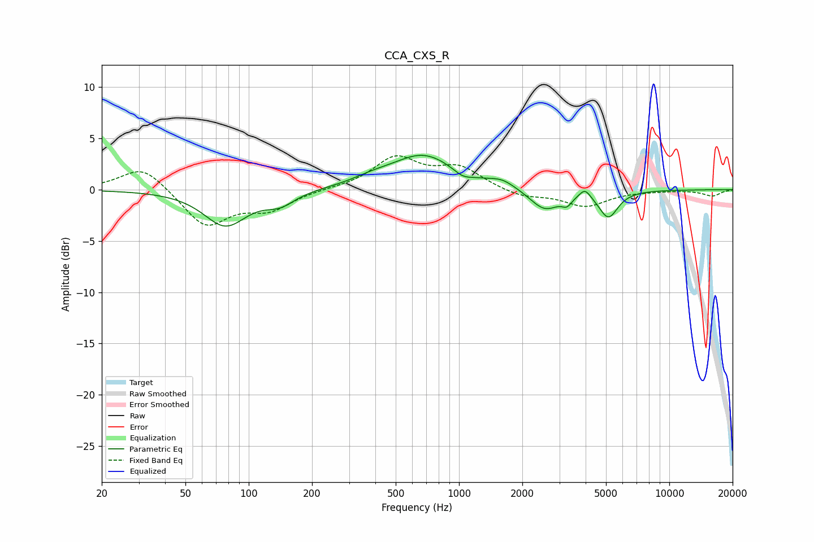

# CCA_CXS_R
See [usage instructions](https://github.com/jaakkopasanen/AutoEq#usage) for more options and info.

### Parametric EQs
Apply preamp of -3.4 dB when using parametric equalizer.

|   # | Type    |   Fc (Hz) |    Q |   Gain (dB) |
|-----|---------|-----------|------|-------------|
|   1 | Peaking |        77 | 1.39 |        -3.5 |
|   2 | Peaking |       141 | 2.02 |        -1.2 |
|   3 | Peaking |       385 | 1.47 |         0.5 |
|   4 | Peaking |       677 | 0.93 |         3.3 |
|   5 | Peaking |      1041 | 3.16 |        -0.6 |
|   6 | Peaking |      1603 | 2.38 |         0.7 |
|   7 | Peaking |      2557 | 2    |        -2.1 |
|   8 | Peaking |      3262 | 6    |        -0.8 |
|   9 | Peaking |      3973 | 5.44 |         0.9 |
|  10 | Peaking |      5134 | 3.1  |        -2.6 |

### Fixed Band EQs
When using fixed band (also called graphic) equalizer, apply preamp of **-3.4 dB** (if available) and set gains manually with these parameters.

|   # | Type    |   Fc (Hz) |    Q |   Gain (dB) |
|-----|---------|-----------|------|-------------|
|   1 | Peaking |        31 | 1.41 |         2.4 |
|   2 | Peaking |        62 | 1.41 |        -3.6 |
|   3 | Peaking |       125 | 1.41 |        -1.8 |
|   4 | Peaking |       250 | 1.41 |         0.1 |
|   5 | Peaking |       500 | 1.41 |         3   |
|   6 | Peaking |      1000 | 1.41 |         2   |
|   7 | Peaking |      2000 | 1.41 |        -0.7 |
|   8 | Peaking |      4000 | 1.41 |        -1.6 |
|   9 | Peaking |      8000 | 1.41 |        -0.1 |
|  10 | Peaking |     16000 | 1.41 |        -0.6 |

### Graphs

