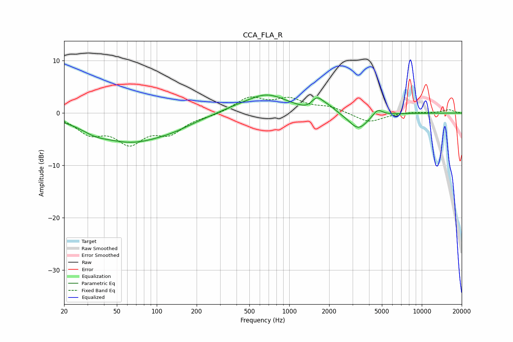

# CCA_FLA_R
See [usage instructions](https://github.com/jaakkopasanen/AutoEq#usage) for more options and info.

### Parametric EQs
Apply preamp of -3.5 dB when using parametric equalizer.

|   # | Type    |   Fc (Hz) |    Q |   Gain (dB) |
|-----|---------|-----------|------|-------------|
|   1 | Peaking |        34 | 1.47 |        -1   |
|   2 | Peaking |        64 | 0.53 |        -5.2 |
|   3 | Peaking |       137 | 0.99 |        -0.9 |
|   4 | Peaking |       378 | 1.22 |         0.5 |
|   5 | Peaking |       674 | 0.91 |         3.5 |
|   6 | Peaking |      1391 | 2.38 |        -0.8 |
|   7 | Peaking |      1617 | 2.94 |         2.5 |
|   8 | Peaking |      1994 | 2.5  |         0.8 |
|   9 | Peaking |      3319 | 1.96 |        -3.2 |
|  10 | Peaking |      4640 | 3.86 |         1.4 |

### Fixed Band EQs
When using fixed band (also called graphic) equalizer, apply preamp of **-3.2 dB** (if available) and set gains manually with these parameters.

|   # | Type    |   Fc (Hz) |    Q |   Gain (dB) |
|-----|---------|-----------|------|-------------|
|   1 | Peaking |        31 | 1.41 |        -3.4 |
|   2 | Peaking |        62 | 1.41 |        -5.1 |
|   3 | Peaking |       125 | 1.41 |        -3.3 |
|   4 | Peaking |       250 | 1.41 |        -0.4 |
|   5 | Peaking |       500 | 1.41 |         2.8 |
|   6 | Peaking |      1000 | 1.41 |         2.4 |
|   7 | Peaking |      2000 | 1.41 |         1.1 |
|   8 | Peaking |      4000 | 1.41 |        -1.8 |
|   9 | Peaking |      8000 | 1.41 |         0.2 |
|  10 | Peaking |     16000 | 1.41 |         0.6 |

### Graphs

