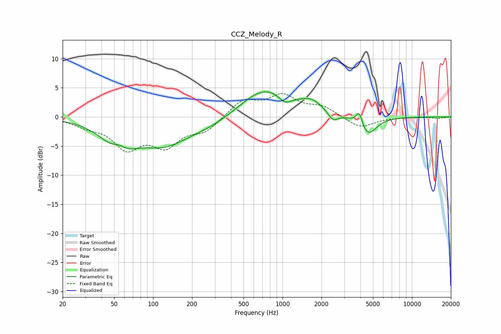

# CCZ_Melody_R
See [usage instructions](https://github.com/jaakkopasanen/AutoEq#usage) for more options and info.

### Parametric EQs
Apply preamp of -4.4 dB when using parametric equalizer.

|   # | Type    |   Fc (Hz) |    Q |   Gain (dB) |
|-----|---------|-----------|------|-------------|
|   1 | Peaking |        55 | 1.21 |        -5.7 |
|   2 | Peaking |        55 | 2.31 |         2.3 |
|   3 | Peaking |       121 | 0.77 |        -4   |
|   4 | Peaking |       266 | 0.73 |        -1.4 |
|   5 | Peaking |       719 | 0.79 |         4.9 |
|   6 | Peaking |      1043 | 3.13 |        -1.2 |
|   7 | Peaking |      1673 | 1.54 |         2   |
|   8 | Peaking |      2455 | 3.57 |        -1.5 |
|   9 | Peaking |      3920 | 5.8  |         2.4 |
|  10 | Peaking |      4555 | 2.14 |        -3.3 |

### Fixed Band EQs
When using fixed band (also called graphic) equalizer, apply preamp of **-4.1 dB** (if available) and set gains manually with these parameters.

|   # | Type    |   Fc (Hz) |    Q |   Gain (dB) |
|-----|---------|-----------|------|-------------|
|   1 | Peaking |        31 | 1.41 |        -1.2 |
|   2 | Peaking |        62 | 1.41 |        -4.9 |
|   3 | Peaking |       125 | 1.41 |        -4.4 |
|   4 | Peaking |       250 | 1.41 |        -2.3 |
|   5 | Peaking |       500 | 1.41 |         2.8 |
|   6 | Peaking |      1000 | 1.41 |         3.4 |
|   7 | Peaking |      2000 | 1.41 |         1.6 |
|   8 | Peaking |      4000 | 1.41 |        -2   |
|   9 | Peaking |      8000 | 1.41 |        -0.1 |
|  10 | Peaking |     16000 | 1.41 |        -0.2 |

### Graphs

