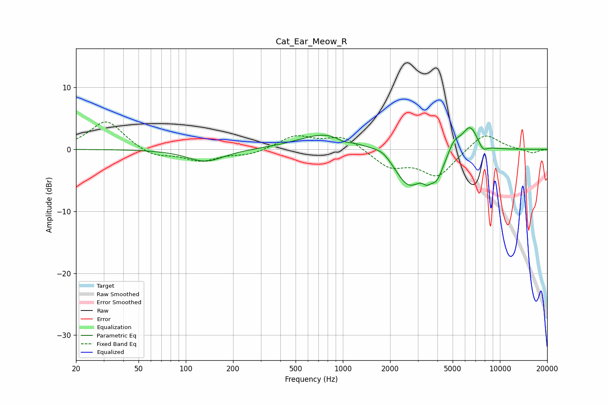

# Cat_Ear_Meow_R
See [usage instructions](https://github.com/jaakkopasanen/AutoEq#usage) for more options and info.

### Parametric EQs
Apply preamp of -3.6 dB when using parametric equalizer.

|   # | Type    |   Fc (Hz) |    Q |   Gain (dB) |
|-----|---------|-----------|------|-------------|
|   1 | Peaking |       134 | 1.23 |        -2   |
|   2 | Peaking |       800 | 0.81 |         2.7 |
|   3 | Peaking |      1010 | 2.97 |        -0.6 |
|   4 | Peaking |      1805 | 2.26 |         1.1 |
|   5 | Peaking |      2620 | 1.48 |        -6   |
|   6 | Peaking |      3422 | 5.81 |        -1.1 |
|   7 | Peaking |      3949 | 3.13 |        -3.5 |
|   8 | Peaking |      5135 | 3.57 |         1.9 |
|   9 | Peaking |      6448 | 2.73 |         4   |
|  10 | Peaking |      7795 | 4.89 |        -1.2 |

### Fixed Band EQs
When using fixed band (also called graphic) equalizer, apply preamp of **-4.5 dB** (if available) and set gains manually with these parameters.

|   # | Type    |   Fc (Hz) |    Q |   Gain (dB) |
|-----|---------|-----------|------|-------------|
|   1 | Peaking |        31 | 1.41 |         4.7 |
|   2 | Peaking |        62 | 1.41 |        -1.3 |
|   3 | Peaking |       125 | 1.41 |        -1.8 |
|   4 | Peaking |       250 | 1.41 |        -0.9 |
|   5 | Peaking |       500 | 1.41 |         2.1 |
|   6 | Peaking |      1000 | 1.41 |         2.1 |
|   7 | Peaking |      2000 | 1.41 |        -2.8 |
|   8 | Peaking |      4000 | 1.41 |        -4.3 |
|   9 | Peaking |      8000 | 1.41 |         2.8 |
|  10 | Peaking |     16000 | 1.41 |        -0.7 |

### Graphs

