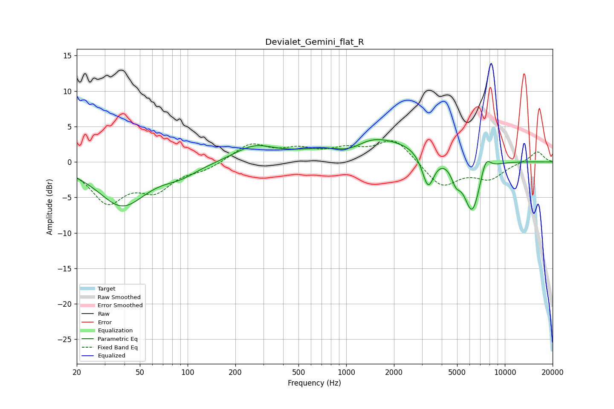

# Devialet_Gemini_flat_R
See [usage instructions](https://github.com/jaakkopasanen/AutoEq#usage) for more options and info.

### Parametric EQs
Apply preamp of -3.3 dB when using parametric equalizer.

|   # | Type    |   Fc (Hz) |    Q |   Gain (dB) |
|-----|---------|-----------|------|-------------|
|   1 | Peaking |        39 | 0.93 |        -6.1 |
|   2 | Peaking |        90 | 1.3  |        -1.3 |
|   3 | Peaking |       262 | 1.13 |         2   |
|   4 | Peaking |      1042 | 1.54 |        -1.2 |
|   5 | Peaking |      1458 | 1.4  |         0.7 |
|   6 | Peaking |      1698 | 0.34 |         3.1 |
|   7 | Peaking |      3282 | 3.68 |        -5   |
|   8 | Peaking |      4913 | 4.84 |        -2   |
|   9 | Peaking |      6220 | 2.46 |        -8   |
|  10 | Peaking |      7563 | 4.13 |         2.5 |

### Fixed Band EQs
When using fixed band (also called graphic) equalizer, apply preamp of **-3.1 dB** (if available) and set gains manually with these parameters.

|   # | Type    |   Fc (Hz) |    Q |   Gain (dB) |
|-----|---------|-----------|------|-------------|
|   1 | Peaking |        31 | 1.41 |        -5.4 |
|   2 | Peaking |        62 | 1.41 |        -3.5 |
|   3 | Peaking |       125 | 1.41 |        -0.9 |
|   4 | Peaking |       250 | 1.41 |         2.5 |
|   5 | Peaking |       500 | 1.41 |         1.5 |
|   6 | Peaking |      1000 | 1.41 |         1.5 |
|   7 | Peaking |      2000 | 1.41 |         3.3 |
|   8 | Peaking |      4000 | 1.41 |        -3.6 |
|   9 | Peaking |      8000 | 1.41 |        -2.2 |
|  10 | Peaking |     16000 | 1.41 |         1.6 |

### Graphs

