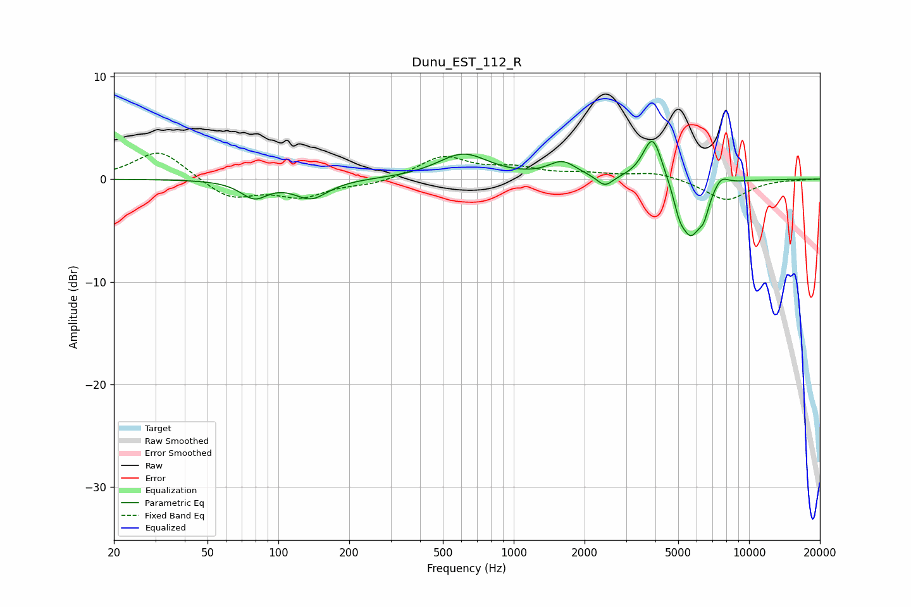

# Dunu_EST_112_R
See [usage instructions](https://github.com/jaakkopasanen/AutoEq#usage) for more options and info.

### Parametric EQs
Apply preamp of -3.8 dB when using parametric equalizer.

|   # | Type    |   Fc (Hz) |    Q |   Gain (dB) |
|-----|---------|-----------|------|-------------|
|   1 | Peaking |        79 | 2.5  |        -1.7 |
|   2 | Peaking |       138 | 1.99 |        -1.8 |
|   3 | Peaking |       610 | 1.31 |         2.4 |
|   4 | Peaking |      1610 | 2.38 |         1.5 |
|   5 | Peaking |      2442 | 4.16 |        -1.1 |
|   6 | Peaking |      3896 | 3.38 |         4.5 |
|   7 | Peaking |      5053 | 5.99 |        -1.5 |
|   8 | Peaking |      5645 | 2.99 |        -5.3 |
|   9 | Peaking |      6424 | 5.99 |        -1.7 |
|  10 | Peaking |      7604 | 4.28 |         1   |

### Fixed Band EQs
When using fixed band (also called graphic) equalizer, apply preamp of **-2.6 dB** (if available) and set gains manually with these parameters.

|   # | Type    |   Fc (Hz) |    Q |   Gain (dB) |
|-----|---------|-----------|------|-------------|
|   1 | Peaking |        31 | 1.41 |         2.9 |
|   2 | Peaking |        62 | 1.41 |        -1.9 |
|   3 | Peaking |       125 | 1.41 |        -1.6 |
|   4 | Peaking |       250 | 1.41 |        -0.5 |
|   5 | Peaking |       500 | 1.41 |         2.2 |
|   6 | Peaking |      1000 | 1.41 |         0.9 |
|   7 | Peaking |      2000 | 1.41 |         0.4 |
|   8 | Peaking |      4000 | 1.41 |         0.7 |
|   9 | Peaking |      8000 | 1.41 |        -2.1 |
|  10 | Peaking |     16000 | 1.41 |        -0   |

### Graphs

