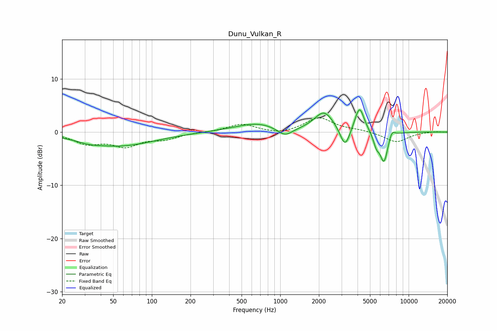

# Dunu_Vulkan_R
See [usage instructions](https://github.com/jaakkopasanen/AutoEq#usage) for more options and info.

### Parametric EQs
Apply preamp of -4.2 dB when using parametric equalizer.

|   # | Type    |   Fc (Hz) |    Q |   Gain (dB) |
|-----|---------|-----------|------|-------------|
|   1 | Peaking |        32 | 1.94 |        -0.4 |
|   2 | Peaking |        55 | 0.51 |        -2.6 |
|   3 | Peaking |       665 | 0.79 |         1.7 |
|   4 | Peaking |      1087 | 2.3  |        -1.7 |
|   5 | Peaking |      2194 | 1.91 |         3.7 |
|   6 | Peaking |      3198 | 3.75 |        -3.9 |
|   7 | Peaking |      4143 | 3.85 |         4.8 |
|   8 | Peaking |      5605 | 5.9  |        -2.1 |
|   9 | Peaking |      6425 | 4.32 |        -5.7 |
|  10 | Peaking |      7399 | 5.45 |         1.5 |

### Fixed Band EQs
When using fixed band (also called graphic) equalizer, apply preamp of **-2.8 dB** (if available) and set gains manually with these parameters.

|   # | Type    |   Fc (Hz) |    Q |   Gain (dB) |
|-----|---------|-----------|------|-------------|
|   1 | Peaking |        31 | 1.41 |        -2   |
|   2 | Peaking |        62 | 1.41 |        -2.4 |
|   3 | Peaking |       125 | 1.41 |        -1.1 |
|   4 | Peaking |       250 | 1.41 |        -0   |
|   5 | Peaking |       500 | 1.41 |         1.5 |
|   6 | Peaking |      1000 | 1.41 |        -0.5 |
|   7 | Peaking |      2000 | 1.41 |         2.7 |
|   8 | Peaking |      4000 | 1.41 |         0.3 |
|   9 | Peaking |      8000 | 1.41 |        -1.9 |
|  10 | Peaking |     16000 | 1.41 |         0.1 |

### Graphs

