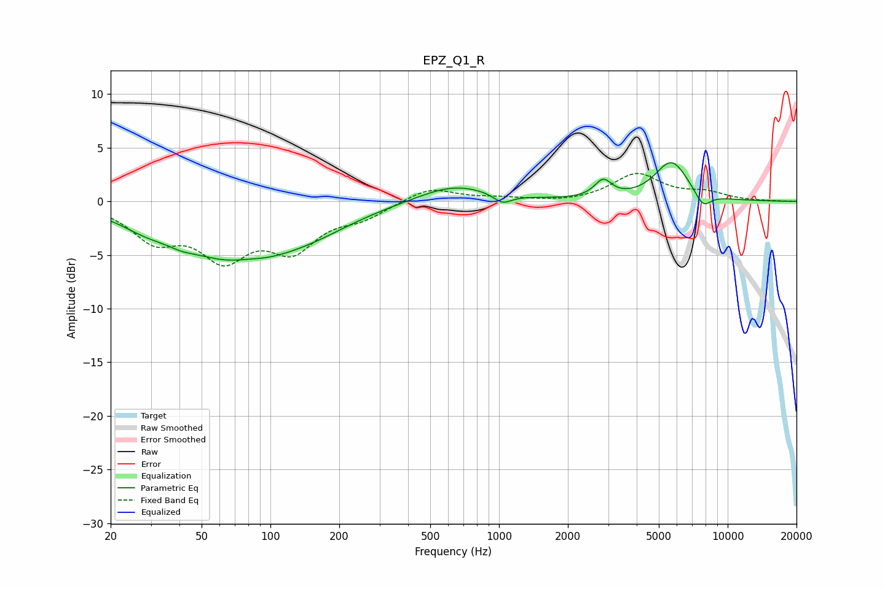

# EPZ_Q1_R
See [usage instructions](https://github.com/jaakkopasanen/AutoEq#usage) for more options and info.

### Parametric EQs
Apply preamp of -3.7 dB when using parametric equalizer.

|   # | Type    |   Fc (Hz) |    Q |   Gain (dB) |
|-----|---------|-----------|------|-------------|
|   1 | Peaking |        28 | 1.54 |        -0.7 |
|   2 | Peaking |        40 | 2.55 |        -0.4 |
|   3 | Peaking |        73 | 0.49 |        -5.4 |
|   4 | Peaking |        80 | 2.06 |         0.3 |
|   5 | Peaking |       159 | 0.87 |        -0.7 |
|   6 | Peaking |       636 | 0.88 |         1.6 |
|   7 | Peaking |      1035 | 3.58 |        -0.9 |
|   8 | Peaking |      2853 | 3.79 |         1.6 |
|   9 | Peaking |      5682 | 1.88 |         3.7 |
|  10 | Peaking |      7791 | 3.75 |        -1.4 |

### Fixed Band EQs
When using fixed band (also called graphic) equalizer, apply preamp of **-2.7 dB** (if available) and set gains manually with these parameters.

|   # | Type    |   Fc (Hz) |    Q |   Gain (dB) |
|-----|---------|-----------|------|-------------|
|   1 | Peaking |        31 | 1.41 |        -3.2 |
|   2 | Peaking |        62 | 1.41 |        -4.7 |
|   3 | Peaking |       125 | 1.41 |        -4   |
|   4 | Peaking |       250 | 1.41 |        -1.3 |
|   5 | Peaking |       500 | 1.41 |         1.4 |
|   6 | Peaking |      1000 | 1.41 |         0.3 |
|   7 | Peaking |      2000 | 1.41 |        -0.1 |
|   8 | Peaking |      4000 | 1.41 |         2.5 |
|   9 | Peaking |      8000 | 1.41 |         0.7 |
|  10 | Peaking |     16000 | 1.41 |         0   |

### Graphs

