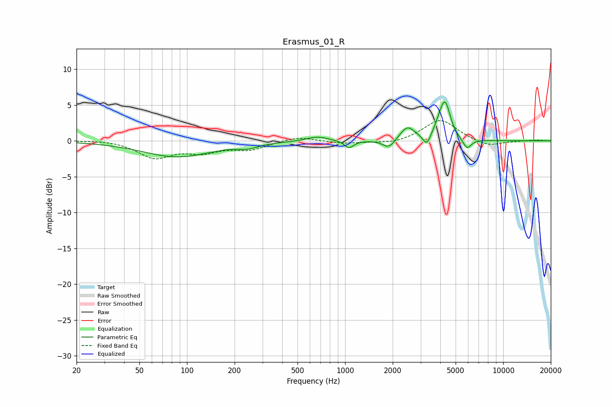

# Erasmus_01_R
See [usage instructions](https://github.com/jaakkopasanen/AutoEq#usage) for more options and info.

### Parametric EQs
Apply preamp of -5.5 dB when using parametric equalizer.

|   # | Type    |   Fc (Hz) |    Q |   Gain (dB) |
|-----|---------|-----------|------|-------------|
|   1 | Peaking |        87 | 0.64 |        -2.2 |
|   2 | Peaking |       243 | 2.3  |        -0.6 |
|   3 | Peaking |       669 | 2.09 |         0.7 |
|   4 | Peaking |      1058 | 4.89 |        -1   |
|   5 | Peaking |      1894 | 3.7  |        -1.3 |
|   6 | Peaking |      2479 | 3.04 |         1.9 |
|   7 | Peaking |      3285 | 5.99 |        -1.6 |
|   8 | Peaking |      4018 | 3.95 |         1.8 |
|   9 | Peaking |      4319 | 4.51 |         4.2 |
|  10 | Peaking |      5901 | 5.16 |        -1.5 |

### Fixed Band EQs
When using fixed band (also called graphic) equalizer, apply preamp of **-2.9 dB** (if available) and set gains manually with these parameters.

|   # | Type    |   Fc (Hz) |    Q |   Gain (dB) |
|-----|---------|-----------|------|-------------|
|   1 | Peaking |        31 | 1.41 |         0.2 |
|   2 | Peaking |        62 | 1.41 |        -2.3 |
|   3 | Peaking |       125 | 1.41 |        -1.3 |
|   4 | Peaking |       250 | 1.41 |        -1.1 |
|   5 | Peaking |       500 | 1.41 |         0.6 |
|   6 | Peaking |      1000 | 1.41 |        -0.4 |
|   7 | Peaking |      2000 | 1.41 |        -0.5 |
|   8 | Peaking |      4000 | 1.41 |         3   |
|   9 | Peaking |      8000 | 1.41 |        -0.9 |
|  10 | Peaking |     16000 | 1.41 |         0.1 |

### Graphs

