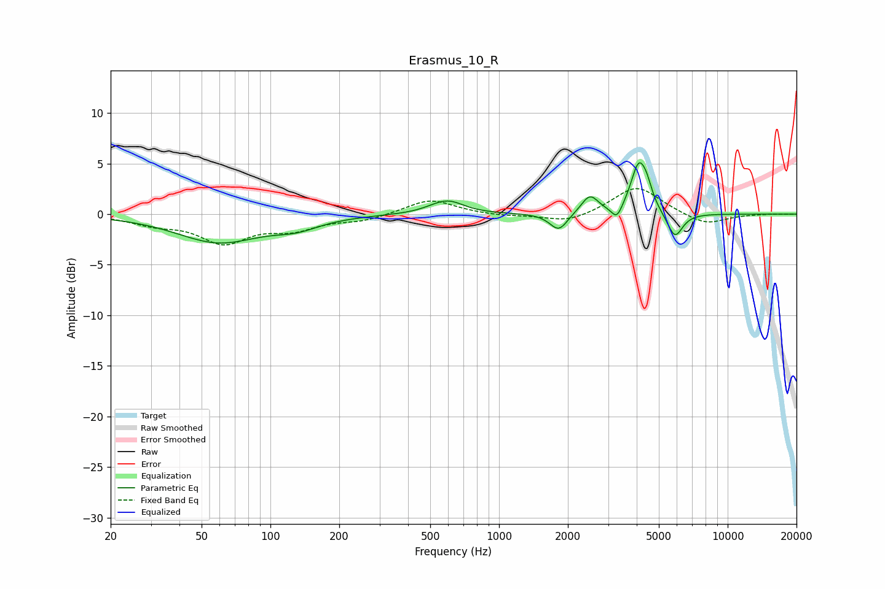

# Erasmus_10_R
See [usage instructions](https://github.com/jaakkopasanen/AutoEq#usage) for more options and info.

### Parametric EQs
Apply preamp of -5.2 dB when using parametric equalizer.

|   # | Type    |   Fc (Hz) |    Q |   Gain (dB) |
|-----|---------|-----------|------|-------------|
|   1 | Peaking |        59 | 0.77 |        -2.7 |
|   2 | Peaking |       130 | 1.41 |        -0.9 |
|   3 | Peaking |       575 | 3.09 |        -0.3 |
|   4 | Peaking |       585 | 2.11 |         1.7 |
|   5 | Peaking |      1824 | 3.65 |        -1.7 |
|   6 | Peaking |      2494 | 3.81 |         1.8 |
|   7 | Peaking |      3276 | 6    |        -1.4 |
|   8 | Peaking |      4082 | 4.06 |         4.7 |
|   9 | Peaking |      4438 | 5.93 |         1.3 |
|  10 | Peaking |      5876 | 4.11 |        -2.5 |

### Fixed Band EQs
When using fixed band (also called graphic) equalizer, apply preamp of **-2.6 dB** (if available) and set gains manually with these parameters.

|   # | Type    |   Fc (Hz) |    Q |   Gain (dB) |
|-----|---------|-----------|------|-------------|
|   1 | Peaking |        31 | 1.41 |        -0.8 |
|   2 | Peaking |        62 | 1.41 |        -2.6 |
|   3 | Peaking |       125 | 1.41 |        -1.3 |
|   4 | Peaking |       250 | 1.41 |        -0.6 |
|   5 | Peaking |       500 | 1.41 |         1.5 |
|   6 | Peaking |      1000 | 1.41 |        -0.2 |
|   7 | Peaking |      2000 | 1.41 |        -0.9 |
|   8 | Peaking |      4000 | 1.41 |         2.8 |
|   9 | Peaking |      8000 | 1.41 |        -1.1 |
|  10 | Peaking |     16000 | 1.41 |         0   |

### Graphs

