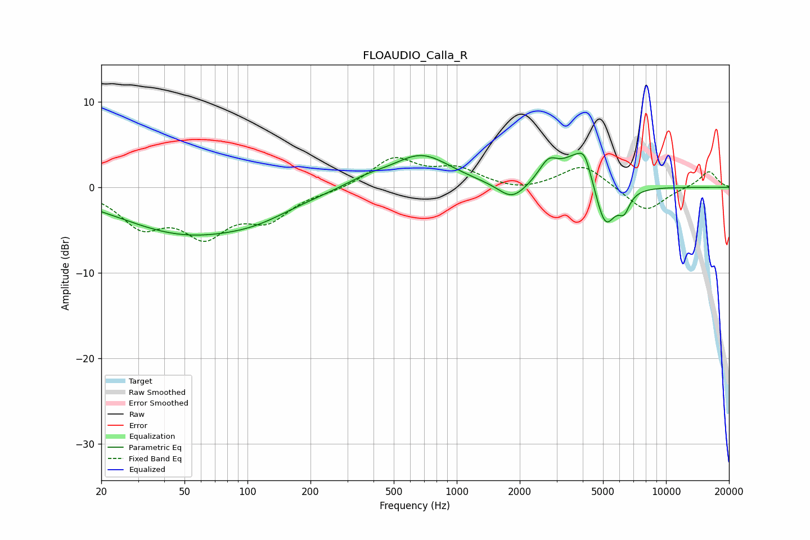

# FLOAUDIO_Calla_R
See [usage instructions](https://github.com/jaakkopasanen/AutoEq#usage) for more options and info.

### Parametric EQs
Apply preamp of -4.1 dB when using parametric equalizer.

|   # | Type    |   Fc (Hz) |    Q |   Gain (dB) |
|-----|---------|-----------|------|-------------|
|   1 | Peaking |        50 | 0.44 |        -5.1 |
|   2 | Peaking |       112 | 0.8  |        -1.4 |
|   3 | Peaking |       366 | 1.36 |         0.8 |
|   4 | Peaking |       677 | 1    |         3.8 |
|   5 | Peaking |      1839 | 2.1  |        -2.1 |
|   6 | Peaking |      2741 | 3.09 |         2.3 |
|   7 | Peaking |      3814 | 1.76 |         4   |
|   8 | Peaking |      4096 | 4.99 |         1.8 |
|   9 | Peaking |      5118 | 2.76 |        -5.7 |
|  10 | Peaking |      6312 | 5.13 |        -2   |

### Fixed Band EQs
When using fixed band (also called graphic) equalizer, apply preamp of **-3.6 dB** (if available) and set gains manually with these parameters.

|   # | Type    |   Fc (Hz) |    Q |   Gain (dB) |
|-----|---------|-----------|------|-------------|
|   1 | Peaking |        31 | 1.41 |        -4.1 |
|   2 | Peaking |        62 | 1.41 |        -5   |
|   3 | Peaking |       125 | 1.41 |        -3.3 |
|   4 | Peaking |       250 | 1.41 |        -0.4 |
|   5 | Peaking |       500 | 1.41 |         3.3 |
|   6 | Peaking |      1000 | 1.41 |         2   |
|   7 | Peaking |      2000 | 1.41 |        -0.6 |
|   8 | Peaking |      4000 | 1.41 |         2.7 |
|   9 | Peaking |      8000 | 1.41 |        -3   |
|  10 | Peaking |     16000 | 1.41 |         1.9 |

### Graphs

