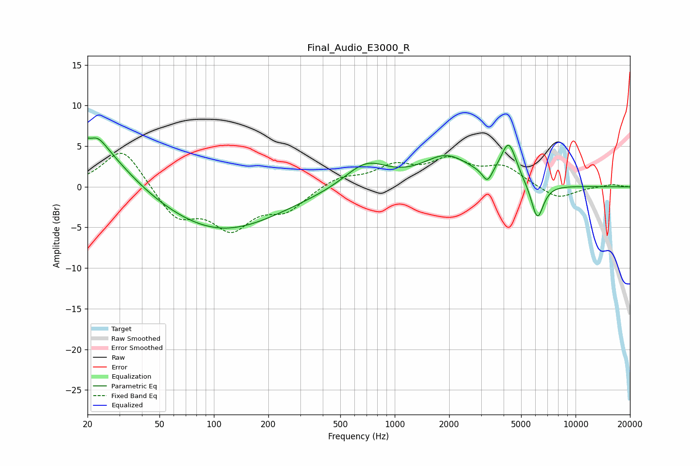

# Final_Audio_E3000_R
See [usage instructions](https://github.com/jaakkopasanen/AutoEq#usage) for more options and info.

### Parametric EQs
Apply preamp of -6.1 dB when using parametric equalizer.

|   # | Type    |   Fc (Hz) |    Q |   Gain (dB) |
|-----|---------|-----------|------|-------------|
|   1 | Peaking |        20 | 5.44 |         3.4 |
|   2 | Peaking |        20 | 5.44 |        -2.7 |
|   3 | Peaking |        22 | 2.63 |         2   |
|   4 | Peaking |        23 | 0.82 |         5.1 |
|   5 | Peaking |       108 | 0.42 |        -5.5 |
|   6 | Peaking |       694 | 1.19 |         3   |
|   7 | Peaking |      1934 | 1.06 |         3.5 |
|   8 | Peaking |      3252 | 5.46 |        -1.6 |
|   9 | Peaking |      4268 | 3.18 |         4.9 |
|  10 | Peaking |      6146 | 4.03 |        -4.5 |

### Fixed Band EQs
When using fixed band (also called graphic) equalizer, apply preamp of **-4.2 dB** (if available) and set gains manually with these parameters.

|   # | Type    |   Fc (Hz) |    Q |   Gain (dB) |
|-----|---------|-----------|------|-------------|
|   1 | Peaking |        31 | 1.41 |         5   |
|   2 | Peaking |        62 | 1.41 |        -3.8 |
|   3 | Peaking |       125 | 1.41 |        -4.7 |
|   4 | Peaking |       250 | 1.41 |        -2.6 |
|   5 | Peaking |       500 | 1.41 |         1.2 |
|   6 | Peaking |      1000 | 1.41 |         2.3 |
|   7 | Peaking |      2000 | 1.41 |         3   |
|   8 | Peaking |      4000 | 1.41 |         2.3 |
|   9 | Peaking |      8000 | 1.41 |        -1.6 |
|  10 | Peaking |     16000 | 1.41 |         0.3 |

### Graphs

