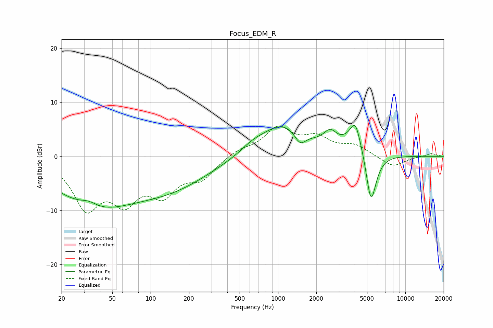

# Focus_EDM_R
See [usage instructions](https://github.com/jaakkopasanen/AutoEq#usage) for more options and info.

### Parametric EQs
Apply preamp of -5.9 dB when using parametric equalizer.

|   # | Type    |   Fc (Hz) |    Q |   Gain (dB) |
|-----|---------|-----------|------|-------------|
|   1 | Peaking |        33 | 2.11 |         1.2 |
|   2 | Peaking |        36 | 0.42 |        -8.6 |
|   3 | Peaking |       153 | 0.46 |        -4.6 |
|   4 | Peaking |       625 | 1.65 |         0.9 |
|   5 | Peaking |      1090 | 0.75 |         6   |
|   6 | Peaking |      1492 | 3.13 |        -2.4 |
|   7 | Peaking |      2570 | 2.77 |         2.5 |
|   8 | Peaking |      4033 | 4.85 |         2   |
|   9 | Peaking |      4107 | 1.89 |         4.9 |
|  10 | Peaking |      5371 | 3.25 |       -10.4 |

### Fixed Band EQs
When using fixed band (also called graphic) equalizer, apply preamp of **-5.7 dB** (if available) and set gains manually with these parameters.

|   # | Type    |   Fc (Hz) |    Q |   Gain (dB) |
|-----|---------|-----------|------|-------------|
|   1 | Peaking |        31 | 1.41 |        -8.9 |
|   2 | Peaking |        62 | 1.41 |        -6.9 |
|   3 | Peaking |       125 | 1.41 |        -5.9 |
|   4 | Peaking |       250 | 1.41 |        -3.6 |
|   5 | Peaking |       500 | 1.41 |         1.2 |
|   6 | Peaking |      1000 | 1.41 |         5   |
|   7 | Peaking |      2000 | 1.41 |         3   |
|   8 | Peaking |      4000 | 1.41 |         1.8 |
|   9 | Peaking |      8000 | 1.41 |        -2   |
|  10 | Peaking |     16000 | 1.41 |         0.6 |

### Graphs

