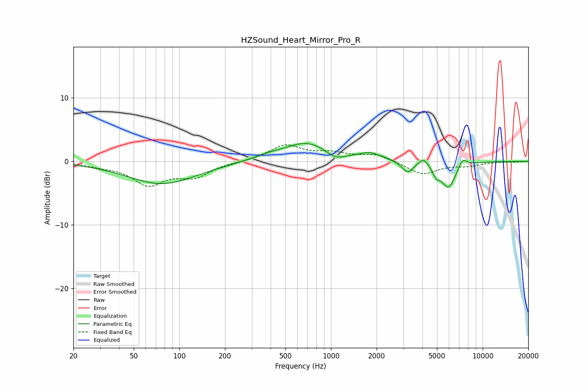

# HZSound_Heart_Mirror_Pro_R
See [usage instructions](https://github.com/jaakkopasanen/AutoEq#usage) for more options and info.

### Parametric EQs
Apply preamp of -2.9 dB when using parametric equalizer.

|   # | Type    |   Fc (Hz) |    Q |   Gain (dB) |
|-----|---------|-----------|------|-------------|
|   1 | Peaking |        77 | 0.62 |        -3.6 |
|   2 | Peaking |       380 | 1.34 |         0.6 |
|   3 | Peaking |       696 | 0.96 |         2.9 |
|   4 | Peaking |      1064 | 2.37 |        -1.1 |
|   5 | Peaking |      1807 | 1.99 |         1.1 |
|   6 | Peaking |      3200 | 3.89 |        -1.8 |
|   7 | Peaking |      4077 | 4.96 |         1.1 |
|   8 | Peaking |      4938 | 5.95 |        -1.3 |
|   9 | Peaking |      5955 | 2.83 |        -4.1 |
|  10 | Peaking |      7362 | 4.79 |         1.4 |

### Fixed Band EQs
When using fixed band (also called graphic) equalizer, apply preamp of **-2.7 dB** (if available) and set gains manually with these parameters.

|   # | Type    |   Fc (Hz) |    Q |   Gain (dB) |
|-----|---------|-----------|------|-------------|
|   1 | Peaking |        31 | 1.41 |        -0.5 |
|   2 | Peaking |        62 | 1.41 |        -3.5 |
|   3 | Peaking |       125 | 1.41 |        -2.2 |
|   4 | Peaking |       250 | 1.41 |        -0   |
|   5 | Peaking |       500 | 1.41 |         2.5 |
|   6 | Peaking |      1000 | 1.41 |         1.1 |
|   7 | Peaking |      2000 | 1.41 |         1.1 |
|   8 | Peaking |      4000 | 1.41 |        -2.1 |
|   9 | Peaking |      8000 | 1.41 |        -0.6 |
|  10 | Peaking |     16000 | 1.41 |        -0.1 |

### Graphs

