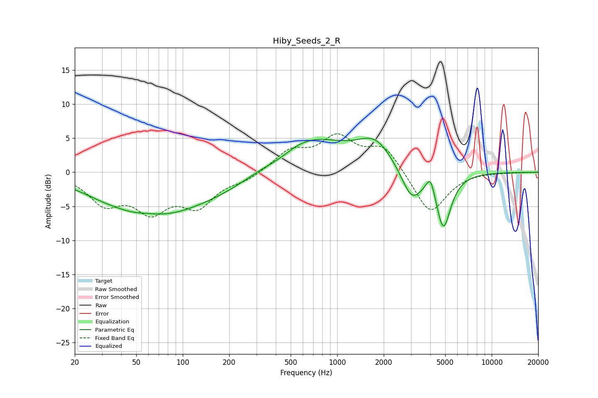

# Hiby_Seeds_2_R
See [usage instructions](https://github.com/jaakkopasanen/AutoEq#usage) for more options and info.

### Parametric EQs
Apply preamp of -5.1 dB when using parametric equalizer.

|   # | Type    |   Fc (Hz) |    Q |   Gain (dB) |
|-----|---------|-----------|------|-------------|
|   1 | Peaking |        29 | 1.86 |        -0.1 |
|   2 | Peaking |        60 | 0.45 |        -6.2 |
|   3 | Peaking |        61 | 1.47 |         0.5 |
|   4 | Peaking |       205 | 0.52 |        -2.2 |
|   5 | Peaking |       424 | 1.44 |        -1   |
|   6 | Peaking |       610 | 0.53 |         5.6 |
|   7 | Peaking |      1768 | 1.26 |         3.7 |
|   8 | Peaking |      3032 | 2.09 |        -4.5 |
|   9 | Peaking |      4017 | 5.09 |         2.8 |
|  10 | Peaking |      4868 | 2.88 |        -8.2 |

### Fixed Band EQs
When using fixed band (also called graphic) equalizer, apply preamp of **-5.7 dB** (if available) and set gains manually with these parameters.

|   # | Type    |   Fc (Hz) |    Q |   Gain (dB) |
|-----|---------|-----------|------|-------------|
|   1 | Peaking |        31 | 1.41 |        -4.2 |
|   2 | Peaking |        62 | 1.41 |        -5   |
|   3 | Peaking |       125 | 1.41 |        -4.5 |
|   4 | Peaking |       250 | 1.41 |        -1   |
|   5 | Peaking |       500 | 1.41 |         2.9 |
|   6 | Peaking |      1000 | 1.41 |         4.7 |
|   7 | Peaking |      2000 | 1.41 |         3.7 |
|   8 | Peaking |      4000 | 1.41 |        -6.3 |
|   9 | Peaking |      8000 | 1.41 |         0.1 |
|  10 | Peaking |     16000 | 1.41 |        -0   |

### Graphs

