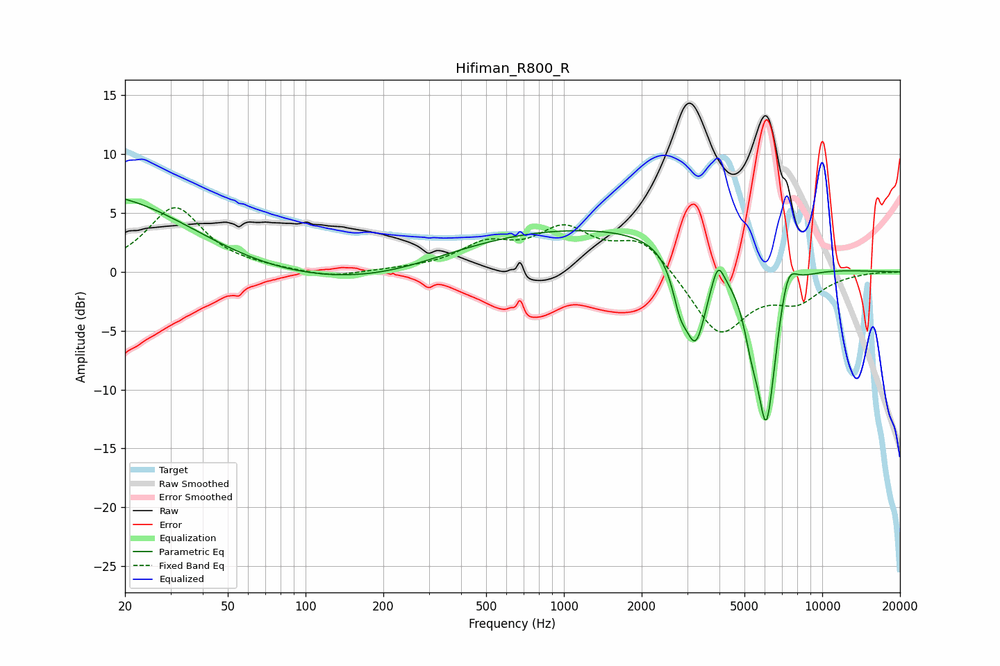

# Hifiman_R800_R
See [usage instructions](https://github.com/jaakkopasanen/AutoEq#usage) for more options and info.

### Parametric EQs
Apply preamp of -6.3 dB when using parametric equalizer.

|   # | Type    |   Fc (Hz) |    Q |   Gain (dB) |
|-----|---------|-----------|------|-------------|
|   1 | Peaking |        20 | 0.3  |         8.4 |
|   2 | Peaking |        49 | 0.4  |        -3.8 |
|   3 | Peaking |       206 | 0.55 |        -1   |
|   4 | Peaking |      1360 | 0.22 |         3.9 |
|   5 | Peaking |      2814 | 4.81 |        -2.8 |
|   6 | Peaking |      3237 | 3.21 |        -7.4 |
|   7 | Peaking |      3942 | 6    |         2.1 |
|   8 | Peaking |      5314 | 4.83 |        -2.4 |
|   9 | Peaking |      6081 | 3.18 |       -14.3 |
|  10 | Peaking |      7338 | 3.81 |         3.2 |

### Fixed Band EQs
When using fixed band (also called graphic) equalizer, apply preamp of **-5.5 dB** (if available) and set gains manually with these parameters.

|   # | Type    |   Fc (Hz) |    Q |   Gain (dB) |
|-----|---------|-----------|------|-------------|
|   1 | Peaking |        31 | 1.41 |         5.4 |
|   2 | Peaking |        62 | 1.41 |         0.2 |
|   3 | Peaking |       125 | 1.41 |        -0.6 |
|   4 | Peaking |       250 | 1.41 |         0.1 |
|   5 | Peaking |       500 | 1.41 |         2.1 |
|   6 | Peaking |      1000 | 1.41 |         3.3 |
|   7 | Peaking |      2000 | 1.41 |         2.8 |
|   8 | Peaking |      4000 | 1.41 |        -5.4 |
|   9 | Peaking |      8000 | 1.41 |        -2.2 |
|  10 | Peaking |     16000 | 1.41 |         0   |

### Graphs

