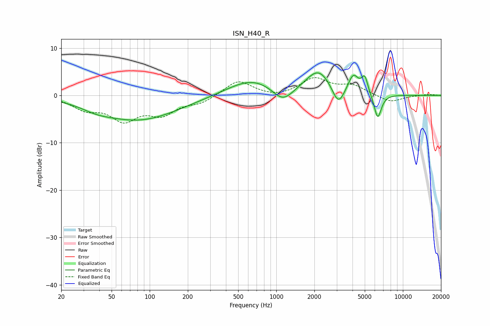

# ISN_H40_R
See [usage instructions](https://github.com/jaakkopasanen/AutoEq#usage) for more options and info.

### Parametric EQs
Apply preamp of -4.8 dB when using parametric equalizer.

|   # | Type    |   Fc (Hz) |    Q |   Gain (dB) |
|-----|---------|-----------|------|-------------|
|   1 | Peaking |        38 | 1.21 |        -1   |
|   2 | Peaking |        78 | 0.49 |        -4.7 |
|   3 | Peaking |       158 | 0.55 |        -0.6 |
|   4 | Peaking |       648 | 0.72 |         3.5 |
|   5 | Peaking |      1127 | 1.68 |        -3.4 |
|   6 | Peaking |      2162 | 1.37 |         5.3 |
|   7 | Peaking |      3087 | 2.86 |        -4.3 |
|   8 | Peaking |      4057 | 3.34 |         3.9 |
|   9 | Peaking |      4999 | 5.66 |         3.3 |
|  10 | Peaking |      6324 | 4.7  |        -5.3 |

### Fixed Band EQs
When using fixed band (also called graphic) equalizer, apply preamp of **-3.9 dB** (if available) and set gains manually with these parameters.

|   # | Type    |   Fc (Hz) |    Q |   Gain (dB) |
|-----|---------|-----------|------|-------------|
|   1 | Peaking |        31 | 1.41 |        -2.5 |
|   2 | Peaking |        62 | 1.41 |        -4.7 |
|   3 | Peaking |       125 | 1.41 |        -3.5 |
|   4 | Peaking |       250 | 1.41 |        -1.4 |
|   5 | Peaking |       500 | 1.41 |         3.2 |
|   6 | Peaking |      1000 | 1.41 |        -0.6 |
|   7 | Peaking |      2000 | 1.41 |         3.5 |
|   8 | Peaking |      4000 | 1.41 |         1.9 |
|   9 | Peaking |      8000 | 1.41 |        -1.5 |
|  10 | Peaking |     16000 | 1.41 |         0.3 |

### Graphs

