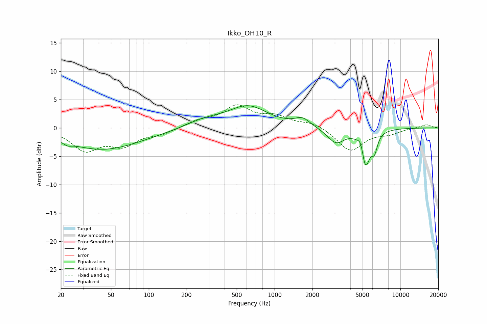

# Ikko_OH10_R
See [usage instructions](https://github.com/jaakkopasanen/AutoEq#usage) for more options and info.

### Parametric EQs
Apply preamp of -4.0 dB when using parametric equalizer.

|   # | Type    |   Fc (Hz) |    Q |   Gain (dB) |
|-----|---------|-----------|------|-------------|
|   1 | Peaking |        23 | 4.58 |        -0.5 |
|   2 | Peaking |        42 | 0.49 |        -3.3 |
|   3 | Peaking |       101 | 0.18 |        -0.6 |
|   4 | Peaking |       273 | 0.85 |         1.5 |
|   5 | Peaking |       616 | 0.89 |         3.8 |
|   6 | Peaking |      1664 | 2.32 |         1.4 |
|   7 | Peaking |      3074 | 2.05 |        -2.6 |
|   8 | Peaking |      4857 | 6    |         2.1 |
|   9 | Peaking |      5264 | 3.84 |        -6.8 |
|  10 | Peaking |      6227 | 5.99 |        -2.6 |

### Fixed Band EQs
When using fixed band (also called graphic) equalizer, apply preamp of **-4.2 dB** (if available) and set gains manually with these parameters.

|   # | Type    |   Fc (Hz) |    Q |   Gain (dB) |
|-----|---------|-----------|------|-------------|
|   1 | Peaking |        31 | 1.41 |        -3.8 |
|   2 | Peaking |        62 | 1.41 |        -2.8 |
|   3 | Peaking |       125 | 1.41 |        -1   |
|   4 | Peaking |       250 | 1.41 |         1.1 |
|   5 | Peaking |       500 | 1.41 |         3.6 |
|   6 | Peaking |      1000 | 1.41 |         1.8 |
|   7 | Peaking |      2000 | 1.41 |         1   |
|   8 | Peaking |      4000 | 1.41 |        -4.1 |
|   9 | Peaking |      8000 | 1.41 |        -0.8 |
|  10 | Peaking |     16000 | 1.41 |         0.6 |

### Graphs

