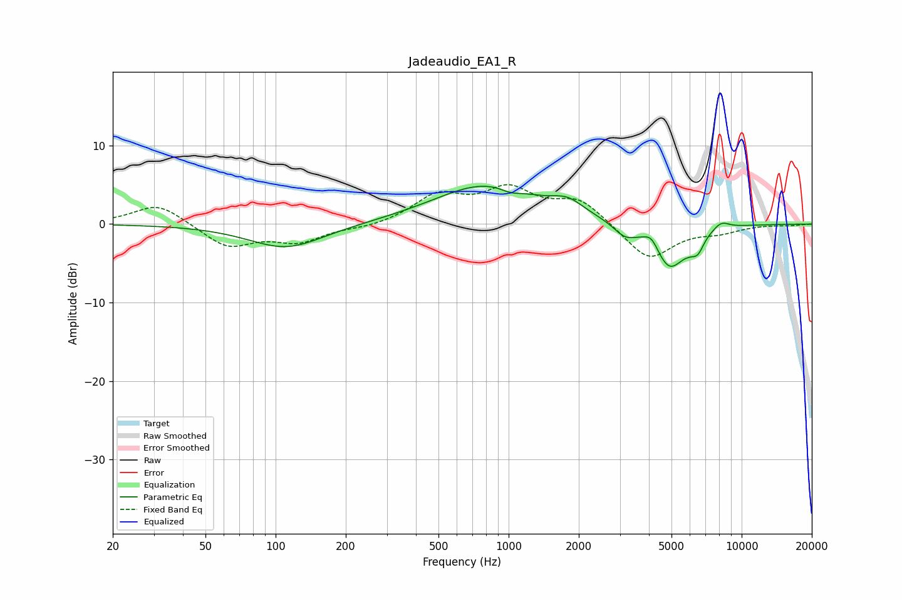

# Jadeaudio_EA1_R
See [usage instructions](https://github.com/jaakkopasanen/AutoEq#usage) for more options and info.

### Parametric EQs
Apply preamp of -4.9 dB when using parametric equalizer.

|   # | Type    |   Fc (Hz) |    Q |   Gain (dB) |
|-----|---------|-----------|------|-------------|
|   1 | Peaking |       111 | 0.88 |        -3.1 |
|   2 | Peaking |       801 | 0.63 |         5   |
|   3 | Peaking |      1020 | 3.13 |        -0.6 |
|   4 | Peaking |      1791 | 2.07 |         1.6 |
|   5 | Peaking |      3149 | 2.92 |        -1.5 |
|   6 | Peaking |      4106 | 4.42 |         1.5 |
|   7 | Peaking |      4889 | 2.04 |        -5.7 |
|   8 | Peaking |      5991 | 4.06 |        -0.6 |
|   9 | Peaking |      6493 | 5.2  |        -1.8 |
|  10 | Peaking |      8173 | 3.79 |         1   |

### Fixed Band EQs
When using fixed band (also called graphic) equalizer, apply preamp of **-5.1 dB** (if available) and set gains manually with these parameters.

|   # | Type    |   Fc (Hz) |    Q |   Gain (dB) |
|-----|---------|-----------|------|-------------|
|   1 | Peaking |        31 | 1.41 |         2.7 |
|   2 | Peaking |        62 | 1.41 |        -2.9 |
|   3 | Peaking |       125 | 1.41 |        -2.1 |
|   4 | Peaking |       250 | 1.41 |        -0.5 |
|   5 | Peaking |       500 | 1.41 |         3.5 |
|   6 | Peaking |      1000 | 1.41 |         4   |
|   7 | Peaking |      2000 | 1.41 |         3   |
|   8 | Peaking |      4000 | 1.41 |        -4.6 |
|   9 | Peaking |      8000 | 1.41 |        -0.9 |
|  10 | Peaking |     16000 | 1.41 |        -0.2 |

### Graphs

