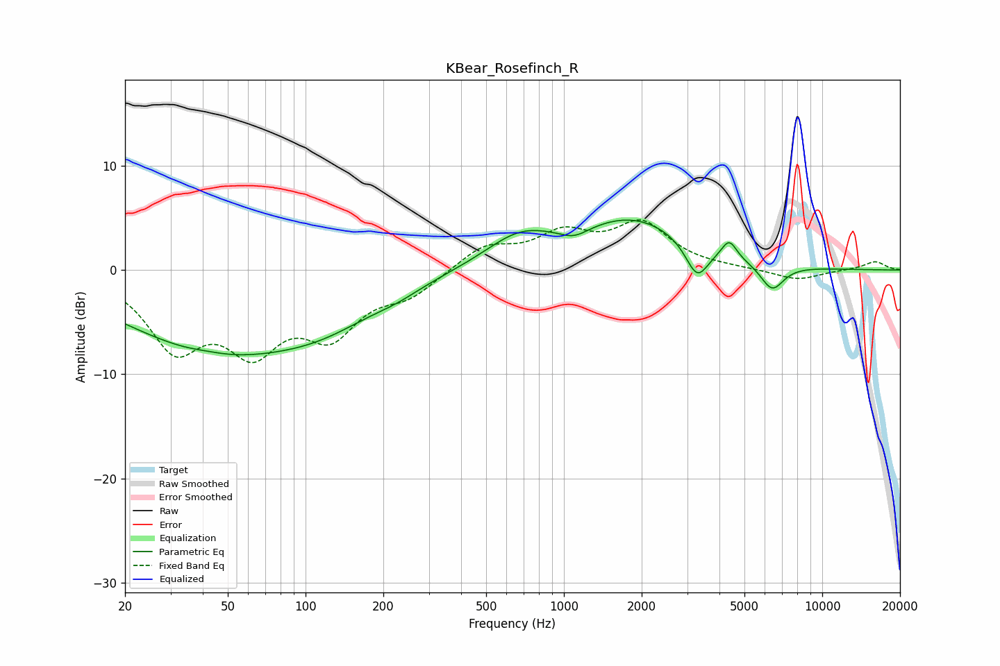

# KBear_Rosefinch_R
See [usage instructions](https://github.com/jaakkopasanen/AutoEq#usage) for more options and info.

### Parametric EQs
Apply preamp of -4.9 dB when using parametric equalizer.

|   # | Type    |   Fc (Hz) |    Q |   Gain (dB) |
|-----|---------|-----------|------|-------------|
|   1 | Peaking |        42 | 2.08 |         0.2 |
|   2 | Peaking |        44 | 0.38 |        -7.3 |
|   3 | Peaking |       119 | 0.64 |        -2.6 |
|   4 | Peaking |       228 | 1.57 |        -0.6 |
|   5 | Peaking |       671 | 1.05 |         2.7 |
|   6 | Peaking |      1096 | 2.57 |        -0.9 |
|   7 | Peaking |      1854 | 0.63 |         4.8 |
|   8 | Peaking |      3278 | 3.17 |        -3.3 |
|   9 | Peaking |      4363 | 4.82 |         1.8 |
|  10 | Peaking |      6394 | 2.98 |        -2.6 |

### Fixed Band EQs
When using fixed band (also called graphic) equalizer, apply preamp of **-4.9 dB** (if available) and set gains manually with these parameters.

|   # | Type    |   Fc (Hz) |    Q |   Gain (dB) |
|-----|---------|-----------|------|-------------|
|   1 | Peaking |        31 | 1.41 |        -6.9 |
|   2 | Peaking |        62 | 1.41 |        -6.5 |
|   3 | Peaking |       125 | 1.41 |        -5.4 |
|   4 | Peaking |       250 | 1.41 |        -2.1 |
|   5 | Peaking |       500 | 1.41 |         2.3 |
|   6 | Peaking |      1000 | 1.41 |         3.1 |
|   7 | Peaking |      2000 | 1.41 |         4.2 |
|   8 | Peaking |      4000 | 1.41 |         0.1 |
|   9 | Peaking |      8000 | 1.41 |        -1   |
|  10 | Peaking |     16000 | 1.41 |         0.8 |

### Graphs

