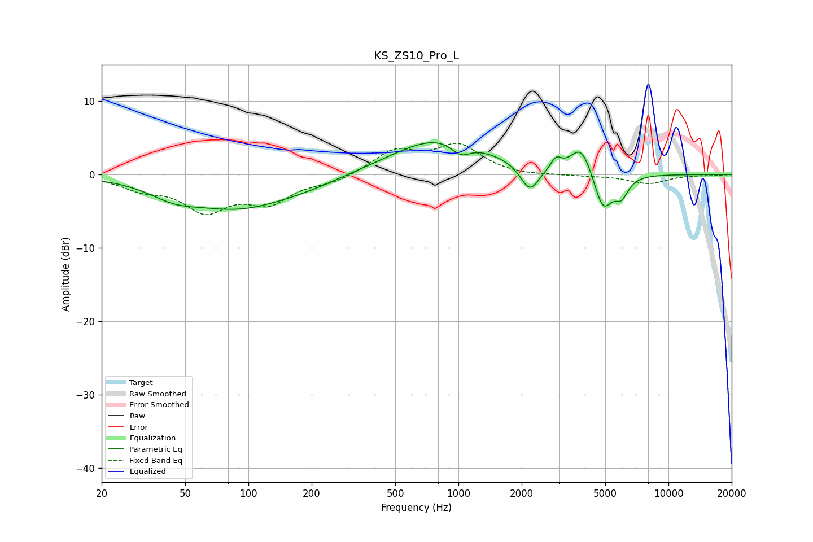

# KS_ZS10_Pro_L
See [usage instructions](https://github.com/jaakkopasanen/AutoEq#usage) for more options and info.

### Parametric EQs
Apply preamp of -4.4 dB when using parametric equalizer.

|   # | Type    |   Fc (Hz) |    Q |   Gain (dB) |
|-----|---------|-----------|------|-------------|
|   1 | Peaking |        44 | 1.2  |        -1.7 |
|   2 | Peaking |        88 | 0.6  |        -4.1 |
|   3 | Peaking |       185 | 0.75 |        -1   |
|   4 | Peaking |       831 | 0.61 |         5.1 |
|   5 | Peaking |      1025 | 3    |        -1.8 |
|   6 | Peaking |      2188 | 3.18 |        -3.7 |
|   7 | Peaking |      2915 | 5.69 |         1.5 |
|   8 | Peaking |      3844 | 2.76 |         4   |
|   9 | Peaking |      4880 | 3.17 |        -5.3 |
|  10 | Peaking |      5976 | 4.22 |        -2.5 |

### Fixed Band EQs
When using fixed band (also called graphic) equalizer, apply preamp of **-4.3 dB** (if available) and set gains manually with these parameters.

|   # | Type    |   Fc (Hz) |    Q |   Gain (dB) |
|-----|---------|-----------|------|-------------|
|   1 | Peaking |        31 | 1.41 |        -1.7 |
|   2 | Peaking |        62 | 1.41 |        -4.5 |
|   3 | Peaking |       125 | 1.41 |        -3.4 |
|   4 | Peaking |       250 | 1.41 |        -1   |
|   5 | Peaking |       500 | 1.41 |         3.1 |
|   6 | Peaking |      1000 | 1.41 |         3.8 |
|   7 | Peaking |      2000 | 1.41 |        -0.3 |
|   8 | Peaking |      4000 | 1.41 |        -0.2 |
|   9 | Peaking |      8000 | 1.41 |        -1.2 |
|  10 | Peaking |     16000 | 1.41 |        -0.1 |

### Graphs

