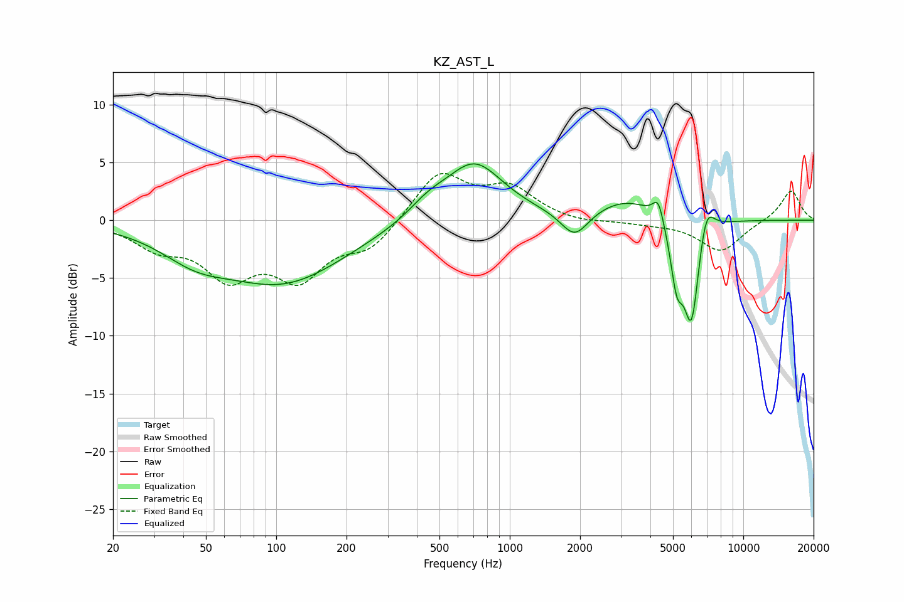

# KZ_AST_L
See [usage instructions](https://github.com/jaakkopasanen/AutoEq#usage) for more options and info.

### Parametric EQs
Apply preamp of -5.0 dB when using parametric equalizer.

|   # | Type    |   Fc (Hz) |    Q |   Gain (dB) |
|-----|---------|-----------|------|-------------|
|   1 | Peaking |        45 | 0.96 |        -2   |
|   2 | Peaking |       108 | 0.53 |        -5.2 |
|   3 | Peaking |       446 | 1.65 |         1.2 |
|   4 | Peaking |       705 | 1.13 |         5   |
|   5 | Peaking |      1897 | 2.37 |        -2.4 |
|   6 | Peaking |      3213 | 0.97 |         1.9 |
|   7 | Peaking |      4326 | 6    |         1.9 |
|   8 | Peaking |      5187 | 5.15 |        -4.6 |
|   9 | Peaking |      6003 | 3.89 |        -9.2 |
|  10 | Peaking |      6914 | 4.05 |         3.1 |

### Fixed Band EQs
When using fixed band (also called graphic) equalizer, apply preamp of **-4.1 dB** (if available) and set gains manually with these parameters.

|   # | Type    |   Fc (Hz) |    Q |   Gain (dB) |
|-----|---------|-----------|------|-------------|
|   1 | Peaking |        31 | 1.41 |        -2   |
|   2 | Peaking |        62 | 1.41 |        -4.4 |
|   3 | Peaking |       125 | 1.41 |        -4.5 |
|   4 | Peaking |       250 | 1.41 |        -2.3 |
|   5 | Peaking |       500 | 1.41 |         4.1 |
|   6 | Peaking |      1000 | 1.41 |         2.6 |
|   7 | Peaking |      2000 | 1.41 |        -0.3 |
|   8 | Peaking |      4000 | 1.41 |        -0.2 |
|   9 | Peaking |      8000 | 1.41 |        -2.7 |
|  10 | Peaking |     16000 | 1.41 |         2.7 |

### Graphs

