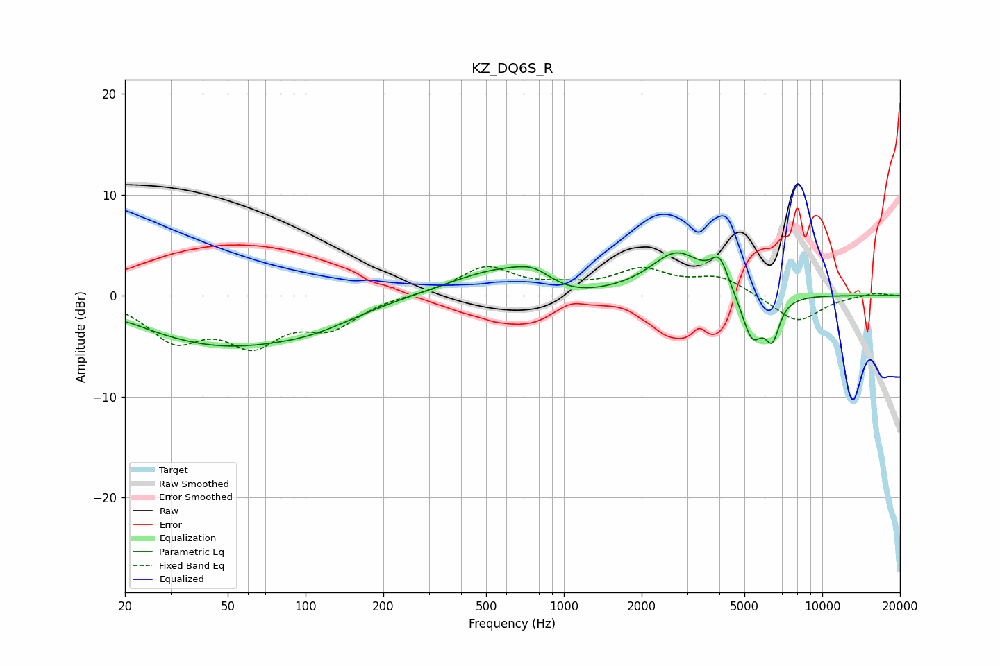

# KZ_DQ6S_R
See [usage instructions](https://github.com/jaakkopasanen/AutoEq#usage) for more options and info.

### Parametric EQs
Apply preamp of -4.3 dB when using parametric equalizer.

|   # | Type    |   Fc (Hz) |    Q |   Gain (dB) |
|-----|---------|-----------|------|-------------|
|   1 | Peaking |        21 | 2.62 |         0.2 |
|   2 | Peaking |        47 | 0.44 |        -4.7 |
|   3 | Peaking |       109 | 0.83 |        -1.2 |
|   4 | Peaking |       600 | 0.69 |         3   |
|   5 | Peaking |       766 | 2.06 |         1.1 |
|   6 | Peaking |      1015 | 0.96 |        -1.5 |
|   7 | Peaking |      2739 | 1.38 |         4.1 |
|   8 | Peaking |      4006 | 4.07 |         2.8 |
|   9 | Peaking |      5354 | 3.31 |        -4.7 |
|  10 | Peaking |      6414 | 4.96 |        -3.6 |

### Fixed Band EQs
When using fixed band (also called graphic) equalizer, apply preamp of **-3.0 dB** (if available) and set gains manually with these parameters.

|   # | Type    |   Fc (Hz) |    Q |   Gain (dB) |
|-----|---------|-----------|------|-------------|
|   1 | Peaking |        31 | 1.41 |        -4   |
|   2 | Peaking |        62 | 1.41 |        -4.2 |
|   3 | Peaking |       125 | 1.41 |        -2.8 |
|   4 | Peaking |       250 | 1.41 |         0.1 |
|   5 | Peaking |       500 | 1.41 |         2.8 |
|   6 | Peaking |      1000 | 1.41 |         0.6 |
|   7 | Peaking |      2000 | 1.41 |         2.3 |
|   8 | Peaking |      4000 | 1.41 |         1.8 |
|   9 | Peaking |      8000 | 1.41 |        -2.7 |
|  10 | Peaking |     16000 | 1.41 |         0.3 |

### Graphs

