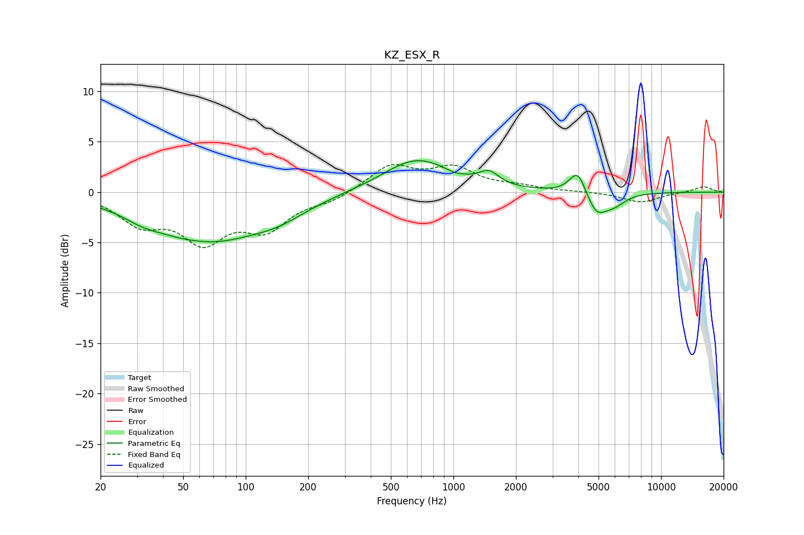

# KZ_ESX_R
See [usage instructions](https://github.com/jaakkopasanen/AutoEq#usage) for more options and info.

### Parametric EQs
Apply preamp of -3.2 dB when using parametric equalizer.

|   # | Type    |   Fc (Hz) |    Q |   Gain (dB) |
|-----|---------|-----------|------|-------------|
|   1 | Peaking |        32 | 1.68 |        -0.6 |
|   2 | Peaking |        61 | 1.31 |         0.3 |
|   3 | Peaking |        64 | 0.55 |        -4.9 |
|   4 | Peaking |       145 | 1.04 |        -1.2 |
|   5 | Peaking |       666 | 0.88 |         3.3 |
|   6 | Peaking |      1019 | 3.57 |        -0.2 |
|   7 | Peaking |      1486 | 3    |         1.2 |
|   8 | Peaking |      3968 | 3.56 |         2.5 |
|   9 | Peaking |      4896 | 2.77 |        -2.2 |
|  10 | Peaking |      5982 | 2.58 |        -1   |

### Fixed Band EQs
When using fixed band (also called graphic) equalizer, apply preamp of **-2.8 dB** (if available) and set gains manually with these parameters.

|   # | Type    |   Fc (Hz) |    Q |   Gain (dB) |
|-----|---------|-----------|------|-------------|
|   1 | Peaking |        31 | 1.41 |        -2.8 |
|   2 | Peaking |        62 | 1.41 |        -4.4 |
|   3 | Peaking |       125 | 1.41 |        -3.3 |
|   4 | Peaking |       250 | 1.41 |        -0.8 |
|   5 | Peaking |       500 | 1.41 |         2.6 |
|   6 | Peaking |      1000 | 1.41 |         2.2 |
|   7 | Peaking |      2000 | 1.41 |         0.5 |
|   8 | Peaking |      4000 | 1.41 |         0   |
|   9 | Peaking |      8000 | 1.41 |        -1   |
|  10 | Peaking |     16000 | 1.41 |         0.6 |

### Graphs

