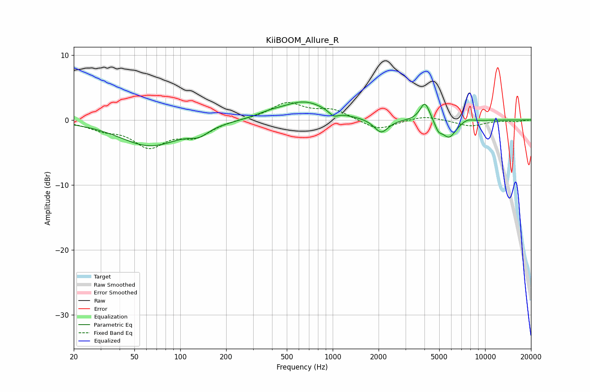

# KiiBOOM_Allure_R
See [usage instructions](https://github.com/jaakkopasanen/AutoEq#usage) for more options and info.

### Parametric EQs
Apply preamp of -2.9 dB when using parametric equalizer.

|   # | Type    |   Fc (Hz) |    Q |   Gain (dB) |
|-----|---------|-----------|------|-------------|
|   1 | Peaking |        63 | 0.71 |        -3.9 |
|   2 | Peaking |       133 | 2.29 |        -1.2 |
|   3 | Peaking |       385 | 1.63 |         0.5 |
|   4 | Peaking |       651 | 0.96 |         2.8 |
|   5 | Peaking |      1014 | 4.7  |        -0.8 |
|   6 | Peaking |      2080 | 3.07 |        -2.2 |
|   7 | Peaking |      4029 | 4.33 |         3   |
|   8 | Peaking |      4938 | 6    |        -1.2 |
|   9 | Peaking |      5795 | 2.94 |        -2.7 |
|  10 | Peaking |      7628 | 3.46 |         0.5 |

### Fixed Band EQs
When using fixed band (also called graphic) equalizer, apply preamp of **-2.8 dB** (if available) and set gains manually with these parameters.

|   # | Type    |   Fc (Hz) |    Q |   Gain (dB) |
|-----|---------|-----------|------|-------------|
|   1 | Peaking |        31 | 1.41 |        -1.2 |
|   2 | Peaking |        62 | 1.41 |        -3.8 |
|   3 | Peaking |       125 | 1.41 |        -2.3 |
|   4 | Peaking |       250 | 1.41 |         0.1 |
|   5 | Peaking |       500 | 1.41 |         2.5 |
|   6 | Peaking |      1000 | 1.41 |         1.5 |
|   7 | Peaking |      2000 | 1.41 |        -1.6 |
|   8 | Peaking |      4000 | 1.41 |         0.7 |
|   9 | Peaking |      8000 | 1.41 |        -1   |
|  10 | Peaking |     16000 | 1.41 |        -0.2 |

### Graphs

