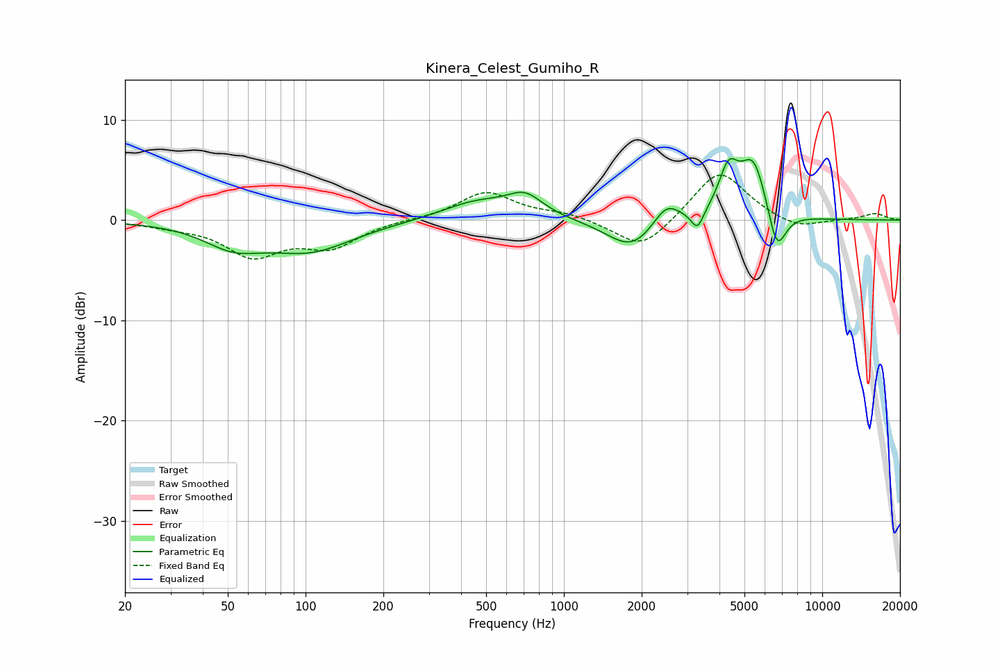

# Kinera_Celest_Gumiho_R
See [usage instructions](https://github.com/jaakkopasanen/AutoEq#usage) for more options and info.

### Parametric EQs
Apply preamp of -6.2 dB when using parametric equalizer.

|   # | Type    |   Fc (Hz) |    Q |   Gain (dB) |
|-----|---------|-----------|------|-------------|
|   1 | Peaking |        52 | 1.26 |        -2.1 |
|   2 | Peaking |       104 | 0.84 |        -2.9 |
|   3 | Peaking |       460 | 1.05 |         1.8 |
|   4 | Peaking |       708 | 2.03 |         2.1 |
|   5 | Peaking |      1834 | 1.47 |        -3.1 |
|   6 | Peaking |      2493 | 2.66 |         2.3 |
|   7 | Peaking |      3287 | 6    |        -1.9 |
|   8 | Peaking |      4337 | 3.7  |         4.2 |
|   9 | Peaking |      5418 | 2.58 |         6   |
|  10 | Peaking |      6666 | 3.79 |        -4.6 |

### Fixed Band EQs
When using fixed band (also called graphic) equalizer, apply preamp of **-4.6 dB** (if available) and set gains manually with these parameters.

|   # | Type    |   Fc (Hz) |    Q |   Gain (dB) |
|-----|---------|-----------|------|-------------|
|   1 | Peaking |        31 | 1.41 |        -0.4 |
|   2 | Peaking |        62 | 1.41 |        -3.4 |
|   3 | Peaking |       125 | 1.41 |        -2.5 |
|   4 | Peaking |       250 | 1.41 |         0   |
|   5 | Peaking |       500 | 1.41 |         2.8 |
|   6 | Peaking |      1000 | 1.41 |         0.6 |
|   7 | Peaking |      2000 | 1.41 |        -3.1 |
|   8 | Peaking |      4000 | 1.41 |         5.1 |
|   9 | Peaking |      8000 | 1.41 |        -1   |
|  10 | Peaking |     16000 | 1.41 |         0.7 |

### Graphs

