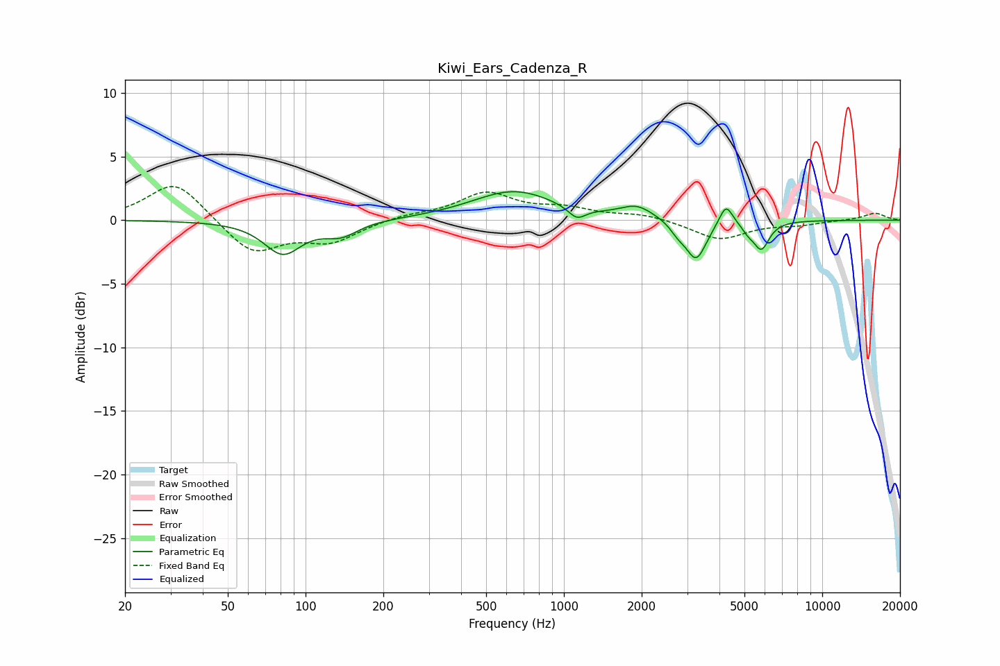

# Kiwi_Ears_Cadenza_R
See [usage instructions](https://github.com/jaakkopasanen/AutoEq#usage) for more options and info.

### Parametric EQs
Apply preamp of -2.3 dB when using parametric equalizer.

|   # | Type    |   Fc (Hz) |    Q |   Gain (dB) |
|-----|---------|-----------|------|-------------|
|   1 | Peaking |        82 | 1.96 |        -2.6 |
|   2 | Peaking |       137 | 2.12 |        -1.1 |
|   3 | Peaking |       640 | 0.88 |         2.3 |
|   4 | Peaking |      1123 | 4.15 |        -0.9 |
|   5 | Peaking |      1917 | 2.24 |         1   |
|   6 | Peaking |      2759 | 4.87 |        -0.6 |
|   7 | Peaking |      3249 | 3.52 |        -3.1 |
|   8 | Peaking |      4241 | 5.39 |         1.7 |
|   9 | Peaking |      5161 | 6    |        -0.5 |
|  10 | Peaking |      5809 | 4.54 |        -2.2 |

### Fixed Band EQs
When using fixed band (also called graphic) equalizer, apply preamp of **-2.7 dB** (if available) and set gains manually with these parameters.

|   # | Type    |   Fc (Hz) |    Q |   Gain (dB) |
|-----|---------|-----------|------|-------------|
|   1 | Peaking |        31 | 1.41 |         3.2 |
|   2 | Peaking |        62 | 1.41 |        -2.7 |
|   3 | Peaking |       125 | 1.41 |        -1.6 |
|   4 | Peaking |       250 | 1.41 |         0.4 |
|   5 | Peaking |       500 | 1.41 |         2.1 |
|   6 | Peaking |      1000 | 1.41 |         0.8 |
|   7 | Peaking |      2000 | 1.41 |         0.4 |
|   8 | Peaking |      4000 | 1.41 |        -1.5 |
|   9 | Peaking |      8000 | 1.41 |        -0.3 |
|  10 | Peaking |     16000 | 1.41 |         0.6 |

### Graphs

