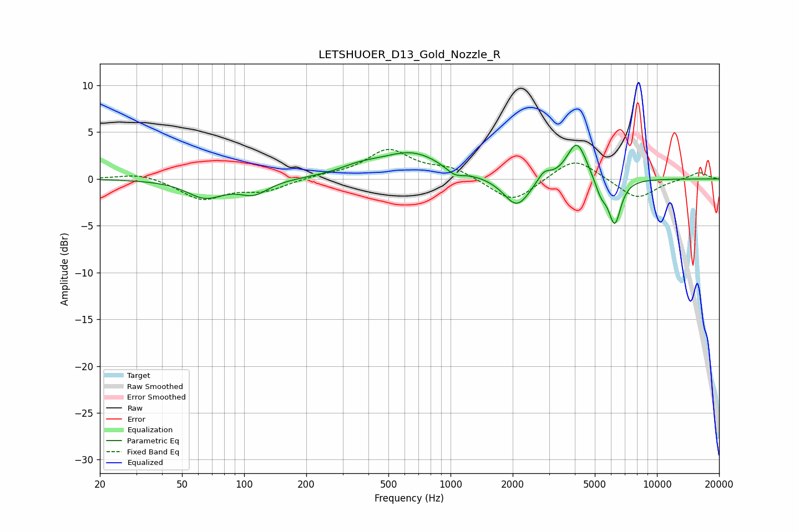

# LETSHUOER_D13_Gold_Nozzle_R
See [usage instructions](https://github.com/jaakkopasanen/AutoEq#usage) for more options and info.

### Parametric EQs
Apply preamp of -3.7 dB when using parametric equalizer.

|   # | Type    |   Fc (Hz) |    Q |   Gain (dB) |
|-----|---------|-----------|------|-------------|
|   1 | Peaking |        65 | 1.58 |        -1.9 |
|   2 | Peaking |       111 | 2.01 |        -1.4 |
|   3 | Peaking |       362 | 1.44 |         0.8 |
|   4 | Peaking |       651 | 0.92 |         2.8 |
|   5 | Peaking |      1048 | 3.22 |        -0.8 |
|   6 | Peaking |      2096 | 2.22 |        -3.2 |
|   7 | Peaking |      2834 | 4.36 |         1.1 |
|   8 | Peaking |      4091 | 2.91 |         4.2 |
|   9 | Peaking |      5354 | 4.71 |        -1.7 |
|  10 | Peaking |      6243 | 4.54 |        -4.8 |

### Fixed Band EQs
When using fixed band (also called graphic) equalizer, apply preamp of **-3.3 dB** (if available) and set gains manually with these parameters.

|   # | Type    |   Fc (Hz) |    Q |   Gain (dB) |
|-----|---------|-----------|------|-------------|
|   1 | Peaking |        31 | 1.41 |         0.7 |
|   2 | Peaking |        62 | 1.41 |        -2.1 |
|   3 | Peaking |       125 | 1.41 |        -1.2 |
|   4 | Peaking |       250 | 1.41 |         0.3 |
|   5 | Peaking |       500 | 1.41 |         3   |
|   6 | Peaking |      1000 | 1.41 |         1.1 |
|   7 | Peaking |      2000 | 1.41 |        -2.6 |
|   8 | Peaking |      4000 | 1.41 |         2.4 |
|   9 | Peaking |      8000 | 1.41 |        -2.2 |
|  10 | Peaking |     16000 | 1.41 |         0.8 |

### Graphs

