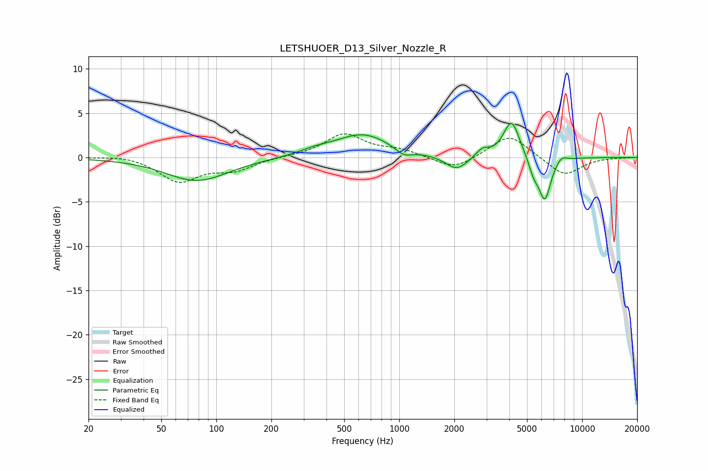

# LETSHUOER_D13_Silver_Nozzle_R
See [usage instructions](https://github.com/jaakkopasanen/AutoEq#usage) for more options and info.

### Parametric EQs
Apply preamp of -3.9 dB when using parametric equalizer.

|   # | Type    |   Fc (Hz) |    Q |   Gain (dB) |
|-----|---------|-----------|------|-------------|
|   1 | Peaking |        78 | 0.83 |        -2.7 |
|   2 | Peaking |       349 | 1.54 |         0.5 |
|   3 | Peaking |       634 | 0.95 |         2.6 |
|   4 | Peaking |      1058 | 3.13 |        -0.8 |
|   5 | Peaking |      2061 | 2.34 |        -1.6 |
|   6 | Peaking |      2848 | 4.09 |         0.9 |
|   7 | Peaking |      4110 | 3.19 |         4.3 |
|   8 | Peaking |      5431 | 5.17 |        -1.6 |
|   9 | Peaking |      6249 | 4.11 |        -4.8 |
|  10 | Peaking |      7707 | 4.68 |         0.7 |

### Fixed Band EQs
When using fixed band (also called graphic) equalizer, apply preamp of **-2.8 dB** (if available) and set gains manually with these parameters.

|   # | Type    |   Fc (Hz) |    Q |   Gain (dB) |
|-----|---------|-----------|------|-------------|
|   1 | Peaking |        31 | 1.41 |         0.3 |
|   2 | Peaking |        62 | 1.41 |        -2.7 |
|   3 | Peaking |       125 | 1.41 |        -1.3 |
|   4 | Peaking |       250 | 1.41 |         0.1 |
|   5 | Peaking |       500 | 1.41 |         2.6 |
|   6 | Peaking |      1000 | 1.41 |         0.8 |
|   7 | Peaking |      2000 | 1.41 |        -1.4 |
|   8 | Peaking |      4000 | 1.41 |         2.7 |
|   9 | Peaking |      8000 | 1.41 |        -2.1 |
|  10 | Peaking |     16000 | 1.41 |        -0   |

### Graphs

