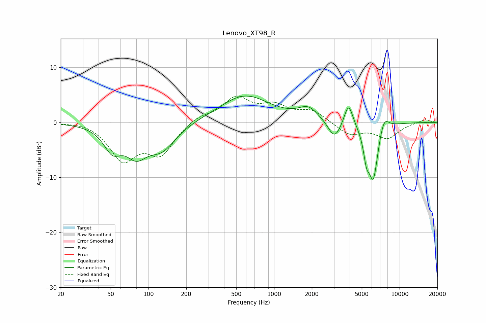

# Lenovo_XT98_R
See [usage instructions](https://github.com/jaakkopasanen/AutoEq#usage) for more options and info.

### Parametric EQs
Apply preamp of -4.9 dB when using parametric equalizer.

|   # | Type    |   Fc (Hz) |    Q |   Gain (dB) |
|-----|---------|-----------|------|-------------|
|   1 | Peaking |        52 | 2    |        -4.1 |
|   2 | Peaking |        80 | 1.68 |        -4.5 |
|   3 | Peaking |       128 | 1.24 |        -4.5 |
|   4 | Peaking |       584 | 0.71 |         4.9 |
|   5 | Peaking |      1882 | 1.81 |         2.3 |
|   6 | Peaking |      3032 | 2.76 |        -3.4 |
|   7 | Peaking |      3924 | 4.02 |         4.3 |
|   8 | Peaking |      5444 | 5.96 |        -3.7 |
|   9 | Peaking |      6173 | 3.36 |       -10.4 |
|  10 | Peaking |      7480 | 3.42 |         3   |

### Fixed Band EQs
When using fixed band (also called graphic) equalizer, apply preamp of **-4.9 dB** (if available) and set gains manually with these parameters.

|   # | Type    |   Fc (Hz) |    Q |   Gain (dB) |
|-----|---------|-----------|------|-------------|
|   1 | Peaking |        31 | 1.41 |         0.4 |
|   2 | Peaking |        62 | 1.41 |        -6.5 |
|   3 | Peaking |       125 | 1.41 |        -5.4 |
|   4 | Peaking |       250 | 1.41 |         1.2 |
|   5 | Peaking |       500 | 1.41 |         4.3 |
|   6 | Peaking |      1000 | 1.41 |         2.6 |
|   7 | Peaking |      2000 | 1.41 |         2.1 |
|   8 | Peaking |      4000 | 1.41 |        -2.2 |
|   9 | Peaking |      8000 | 1.41 |        -2.7 |
|  10 | Peaking |     16000 | 1.41 |         0.6 |

### Graphs

